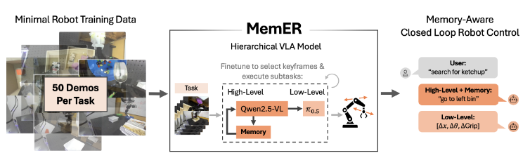
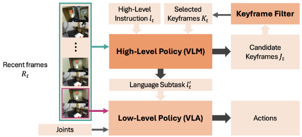

# MemER: Scaling Up Memory for Robot Control via Experience Retrieval
大部分内容来源于alphaxiv




根据这篇论文，**MemER (Memory via Experience Retrieval)** 的主要贡献包括：

## MemER 核心贡献

**1. 提出了一个可扩展的长期记忆框架**

MemER 通过层次化策略框架解决了机器人策略中长期记忆的问题。该框架能够有效处理需要数分钟记忆的复杂长时域任务，这比之前的工作所处理的时间跨度要长得多。

**2. 创新的关键帧选择和记忆构建机制**

- **高层策略**：微调后的视觉-语言模型（Qwen2.5-VL-7B-Instruct）负责从最近的观测中选择和追踪相关的关键帧
- **关键帧过滤算法**：使用简单的一维单链聚类算法来整合候选关键帧，防止记忆占用空间爆炸
- 高层策略将选定的关键帧和最近帧组合后生成文本指令，指导低层策略执行

**3. 数据高效性**

仅需要 **50 个专家演示** 加上最少的语言标注，就能训练出有效的策略。这大大降低了数据收集成本。

**4. 与现有VLA模型兼容**

该方法设计为与现有的视觉-语言-动作（VLA）模型兼容，使用 π0.5 作为低层策略，展示了良好的可扩展性。

### 实验验证

在三个真实世界的长时域机器人操作任务上验证了方法的有效性：

- **物体搜索任务**：跨多个指令记忆物体位置（跨episode记忆）
- **计数任务**：追踪已完成的动作步骤
- **清洁与放置任务**：同时记忆多种信息类型

MemER 的性能显著优于：
- 无历史记忆的策略（48% vs 28%）
- 短历史记忆（8帧）（58% vs 52%）  
- 长历史记忆（32帧）（96% vs 62%）
- 接近人类高层策略的上限（96% vs 96%）

### 技术创新点

**5. 模型融合技术**

通过将微调后的模型权重与预训练模型权重线性插值（α=0.8），保持了模型的鲁棒性和泛化能力。

**6. 纯视觉记忆优于多模态记忆**

实验表明，使用纯图像表示记忆比使用文本或文本+图像的组合更有效，这是一个重要的发现。

这项工作为机器人策略引入了类似人类的"记忆能力"，使机器人能够决定"记住什么"和"何时使用这些记忆"，这是迈向通用机器人系统的重要一步。

***

## MemER 方法的完整工作流程

根据论文，我将详细介绍MemER从训练到部署的完整工作流程。

---

### 一、训练阶段工作流程

#### 1.1 数据收集

**硬件设置**：
- Franka机械臂 + 平行夹爪
- 两个摄像头：第三人称ZED相机 + 腕部miniZED相机
- 分辨率：320×180，采样频率：15Hz

**遥操作数据收集**：
```
1. 预先生成任务的子任务列表
2. 操作员按照当前子任务执行动作
3. 完成子任务时按键盘推进到下一个子任务
4. 自动随机化高层任务（避免人为偏差）
```

**数据规模**（每个任务）：
- 50个长时域轨迹演示
- 10-15个干预演示（用于低层策略鲁棒性）

**数据格式**：$(I_t, q_t, l_t, l'_t, a_t)$
- $I_t$：多相机图像
- $q_t$：机器人关节状态
- $l_t$：高层任务指令
- $l'_t$：当前子任务
- $a_t$：动作

#### 1.2 关键帧标注

**半自动标注流程**：

```
步骤1：人工审查少量演示，为每个子任务类型制定规则
       ├─ 选择第一帧
       ├─ 选择最后一帧  
       └─ 不选择帧

步骤2：将规则自动应用到所有演示
       → 每个子任务段最多1个关键帧

步骤3：生成训练数据的ground truth关键帧标签
```

#### 1.3 模型训练

**低层策略训练**（π₀.₅）：

| 参数 | 值 |
|------|-----|
| 基础模型 | π₀.₅ (在DROID数据集上预训练) |
| 优化器 | AdamW (β₁=0.9, β₂=0.95) |
| 学习率调度 | Cosine + 3.3% warmup |
| Batch Size | 128 |
| 训练步数 | 18,000 |
| 计算资源 | 48 H200 GPU小时 |
| 训练目标 | $\pi_l(A_t \mid I_t, q_t, l'_t)$ |

**高层策略训练**（Qwen2.5-VL-7B）：

| 参数 | 值 |
|------|-----|
| 基础模型 | Qwen2.5-VL-7B-Instruct |
| 优化器 | AdamW (β₁=0.9, β₂=0.999) |
| 学习率调度 | Cosine + 5% warmup |
| Batch Size | 256 |
| 训练步数 | 4,500 |
| 计算资源 | 96 H200 GPU小时 |
| 冻结层 | 视觉编码器 + 投影层 |
| 可训练层 | LLM主干网络 |
| 多任务训练 | 单个策略处理所有3个任务 |

**训练输出**：
- 预测当前子任务 $l'_t$
- 预测候选关键帧位置（1-8索引）

#### 1.4 模型融合

```python
# 权重线性插值
θ = (1 - α) · θ_pre + α · θ_ft

其中：
- θ_pre: Qwen2.5-VL-7B-Instruct预训练权重
- θ_ft: 微调后的权重
- α = 0.8
```

**目的**：保留预训练模型的鲁棒性，同时适应新任务

---

### 二、推理阶段工作流程（闭环部署）

#### 2.1 系统架构

```
┌─────────────────────────────────────────┐
│         环境 (机器人 + 摄像头)            │
└──────────┬──────────────────────────────┘
           │ 图像流 (15Hz)
           ↓
┌──────────────────────────────────────────┐
│     观测队列 (子采样到2Hz)                │
└──────────┬───────────────────────────────┘
           │
    ┌──────┴──────┐
    ↓             ↓
┌────────┐   ┌──────────┐
│高层策略│   │低层策略  │
│ ~1Hz   │   │  ~2Hz    │
│(异步)  │   │ (异步)   │
└────┬───┘   └───┬──────┘
     │           │
     │ 子任务l'ₜ │
     └─────→─────┘
                 │
                 ↓ 动作Aₜ
           ┌──────────┐
           │  机器人  │
           └──────────┘
```

#### 2.2 单个时间步的详细流程

**时间步 t 的处理**：

```
┌─ 步骤1: 观测采集 ─────────────────────────┐
│ • 摄像头流: 15Hz → 子采样到2Hz             │
│ • 当前观测: Iₜ = [I¹ₜ, I²ₜ] (基座+腕部)   │
│ • 机器人状态: qₜ (关节角度 + 夹爪状态)     │
└────────────────────────────────────────────┘
           ↓
┌─ 步骤2: 构建高层策略输入 ─────────────────┐
│ • 最近帧: Rₜ = I_{t-N+1:t} (N=8帧)       │
│ • 选定关键帧: Kₜ (≤8帧，来自过去)         │
│ • 高层任务: lₜ (如"搜索番茄酱")            │
└────────────────────────────────────────────┘
           ↓
┌─ 步骤3: 高层策略推理 (~1Hz) ─────────────┐
│ 输入: πₕ(Rₜ, Kₜ, lₜ)                     │
│                                            │
│ 输出:                                      │
│ • 当前子任务: l'ₜ                         │
│   (如"take ketchup from right bin")      │
│ • 候选关键帧: Jₜ ⊆ Rₜ                     │
│   (索引列表，如[7]表示第7帧)               │
└────────────────────────────────────────────┘
           ↓
┌─ 步骤4: 关键帧过滤 ──────────────────────┐
│ 算法: BuildVisualMemory(J'₀:ₜ, d=5)      │
│                                            │
│ 1. 聚合所有候选: J'₀:ₜ = (J₀,...,Jₜ)     │
│ 2. 提取时间索引: G₀:ₜ (保留重复)          │
│ 3. 1D单链聚类: 距离≤5帧的分为一组         │
│ 4. 选择中位数: 每个聚类选1个代表帧        │
│                                            │
│ 输出: Kₜ₊₁ (更新的选定关键帧集合)         │
└────────────────────────────────────────────┘
           ↓
┌─ 步骤5: 低层策略推理 (~2Hz) ─────────────┐
│ 输入: πₗ(Iₜ, qₜ, l'ₜ)                    │
│                                            │
│ 输出:                                      │
│ • 动作序列: Aₜ = [aₜ, aₜ₊₁,...,aₜ₊₁₄]    │
│   (15个动作的chunk，采样于15Hz)            │
└────────────────────────────────────────────┘
           ↓
┌─ 步骤6: 动作执行 ────────────────────────┐
│ • 执行前8个动作（开环）                    │
│ • 然后重新规划                             │
└────────────────────────────────────────────┘
```

#### 2.3 异步执行机制

```python
# 伪代码
while not task_complete:
    # 高层策略服务器 (~1Hz)
    if high_level_ready:
        queue = collect_recent_frames(N=8)
        l'_t, J_t = high_level_policy(queue, K_t, l_t)
        K_{t+1} = keyframe_filter(J'_{0:t}, d=5)
    
    # 低层策略服务器 (~2Hz，异步)
    A_t = low_level_policy(I_t, q_t, l'_t)  # 使用最新子任务
    execute_actions(A_t[0:8])  # 开环执行8个动作
```

**异步设计的优势**：
- ✅ 高层策略推理时，低层继续执行最新子任务
- ✅ 提高响应性和稳定性
- ✅ 满足实时性要求（高层<1秒延迟）

---

### 三、关键技术细节

#### 3.1 视觉记忆的维护

```
时间轴: ───────────────────────────────────→
        |     已执行         |    最近      |
        |─────────────────|───────────|
              ↓                  ↓
        选定关键帧 Kₜ        最近帧 Rₜ
        (≤8帧)              (8帧)
              ↓                  ↓
        ┌──────────────────────────┐
        │   高层策略的上下文        │
        │   总计≤16帧               │
        └──────────────────────────┘
```

**动态更新**：
- 每个时间步更新 $K_{t+1}$
- 旧的重要信息保留在 $K_t$ 中
- 新的重要信息从 $R_t$ 中提取

#### 3.2 三个任务的具体流程示例

**任务1：物体搜索（跨episode记忆）**
```
Episode 1: "搜索番茄酱"
├─ 看左箱 → Kₜ存储"左箱内容"
├─ 看中箱 → Kₜ存储"中箱内容"  
├─ 看右箱 → Kₜ存储"右箱内容"
└─ 取番茄酱 (利用Kₜ中的记忆定位)

Episode 2: "搜索玉米" (新指令)
├─ 利用Kₜ中的历史记忆
├─ 直接去已知位置
└─ 无需重复搜索！
```

**任务2：计数（追踪完成步骤）**
```
任务: "3勺花生 + 2勺软糖"
├─ 第1勺花生 → Kₜ₊₁ 添加关键帧
├─ 第2勺花生 → Kₜ₊₂ 添加关键帧
├─ 第3勺花生 → Kₜ₊₃ 添加关键帧
├─ 第1勺软糖 → Kₜ₊₄ 添加关键帧
└─ 第2勺软糖 → 高层策略通过Kₜ₊₅判断完成
```

**任务3：清洁与放置（多类型记忆）**
```
任务: "清洁架子并放回物品"
├─ 移除底层物品 → Kₜ存储"物品原始位置"
├─ 移除顶层物品 → Kₜ存储"物品原始位置"
├─ 清洁底层 → Kₜ存储"底层已清洁"
├─ 清洁顶层 → Kₜ存储"顶层已清洁"
├─ 放回底层 (利用Kₜ中的位置记忆)
└─ 放回顶层 (利用Kₜ中的位置记忆)
```

---

### 四、系统性能指标

| 指标 | 值 |
|------|-----|
| 高层策略频率 | ~1Hz |
| 低层策略频率 | ~2Hz |
| 动作chunk大小 | 15个动作 |
| 动作采样频率 | 15Hz |
| 开环执行 | 8个动作 |
| 最近帧窗口 | N=8帧 |
| 最大关键帧数 | 8帧 |
| 聚类合并距离 | d=5帧 |
| 图像分辨率 | 320×180 |
| 高层推理延迟 | <1秒 |

---

### 五、工作流程总结

MemER的核心创新在于：

1. **层次化分解**：高层负责记忆和规划，低层负责执行
2. **选择性记忆**：不是存储所有历史，而是智能选择关键帧
3. **高效过滤**：通过聚类算法防止记忆爆炸
4. **异步执行**：两个策略独立运行，提高实时性
5. **数据高效**：仅需50个演示 + 简单标注规则

这种设计使得MemER能够处理需要**数分钟记忆**的长时域任务，远超之前方法只能处理**数十帧**的能力！

***

### MemER的关键帧选择
根据论文，MemER的关键帧选择分为**训练阶段的标注**和**推理阶段的选择**两个部分：

#### 一、训练阶段：关键帧标注（Ground Truth）

采用**半自动标注流程**，非常高效：

##### 标注规则设计

1. **识别子任务边界**：首先识别连续子任务之间的转换点
2. **人工审查少量演示**：标注员审查少量演示，为每个子任务类型确定简单的标注规则
3. **规则示例**：
   - 选择**最后一帧**："look inside the center bin"（看中间箱子内部）
   - 选择**第一帧**："dust bottom shelf"（清洁底层架子）
   - **不选择帧**："reset scooper position"（重置勺子位置）

##### 具体任务的标注规则

**物体搜索任务**：
- ✅ 选择"look inside the <LOCATION> bin"的**最后一帧**
- ❌ "take the <OBJECT> from bin"不选择帧

**计数任务**：
- ❌ "pick up the scooper"不选择
- ✅ "place a scoop of <OBJECT>"选择**最后一帧**
- ❌ "reset scooper position"不选择

**清洁与放置任务**：
- ✅ "remove the object on the shelf"选择**最后一帧**
- ✅ "dust bottom/top shelf"选择**最后一帧**
- ❌ "reset duster"不选择
- ✅ "place the <OBJECT> on shelf"选择**最后一帧**

这种方法**每个子任务段最多产生1个关键帧**。

---

#### 二、推理阶段：关键帧选择与过滤

##### 2.1 高层策略预测候选关键帧

在每个时间步 $t$，高层策略（微调的Qwen2.5-VL-7B）接收：
- 最近 $N=8$ 帧的观测 $R_t = I_{t-N+1:t}$
- 之前选定的关键帧 $K_t$（最多8个）
- 高层任务指令 $l_t$

输出：
- 当前子任务 $l'_t$
- **候选关键帧** $J_t \subseteq R_t$（从最近观测中选择的子集）

##### 2.2 关键帧过滤算法

使用**1D单链聚类算法**整合所有候选关键帧：

```
算法流程：
1. 提取时间索引：从所有候选关键帧 J'₀:ₜ = (J₀, J₁, ..., Jₜ) 中
   提取时间索引，保留重复索引 → G₀:ₜ

2. 构建聚类：将时间距离 ≤ d（d=5帧）的索引分组
   例如：G₀:ₜ = {1, 3, 3, 4, 10}，d=5
   → 聚类 C₁ = {1, 3, 3, 4}，C₂ = {10}

3. 选择代表帧：从每个聚类选择中位数索引
   → 该索引对应的帧加入 Kₜ
```

##### 关键设计思想

**重复提名的聚合**：
- 保留重复索引很重要
- 如果某帧被多次提名，它在聚类中出现多次
- 中位数选择会倾向于被多次提名的帧
- 这使得最具代表性的帧被选中

**时间覆盖**：
- 对于 $t < t - N + 1 - d$ 的聚类不需要重新计算（效率优化）
- 确保对整个视频流有覆盖

---

#### 三、关键设计优势

##### ✅ 数据效率高
- 标注规则简单，每个子任务类型一个规则
- 规则在所有演示中自动应用

##### ✅ 任务无关
- 过滤算法不依赖特定任务
- 可以泛化到不同的记忆任务

##### ✅ 计算高效
- 不需要额外的评分模型
- 支持流式处理（实时推理）
- 聚类算法复杂度低

##### ✅ 鲁棒性强
- 通过聚类消除冗余
- 重复提名机制增强重要帧的选择
- 自动平衡记忆大小（|Kₜ| ≤ 8）

---

#### 四、可视化示例

论文Figure 3展示了聚类过程：
- **橙色高亮**：每个时间步高层策略提名的候选帧
- **柱状图高度**：表示该时间戳被提名的次数
- **聚类结果**：距离≤5帧的候选被分组
- **最终选择**：每个聚类的中位数帧被加入记忆

这种设计使得MemER能够在长时域任务中高效且准确地维护视觉记忆！