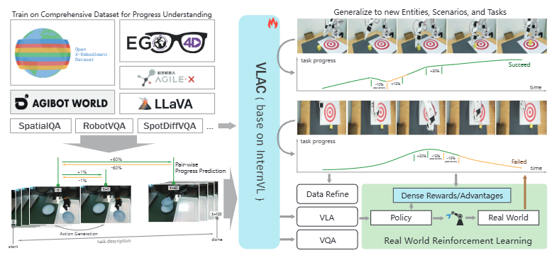

# A Vision-Language-Action-Critic Model for Robotic Real-World Reinforcement Learning

大部分内容来源于alphaxiv





## VLAC（Vision-Language-Action-Critic Model）的主要贡献
### 1. **统一的Actor-Critic模型架构**
- 提出了基于InternVL的统一模型，将"actor"（策略）和"critic"（价值评估）角色整合在单一自回归架构中
- 通过提示控制，同一模型可交替生成奖励token和动作token

### 2. **通用的过程奖励模型**
- **密集进度奖励**：给定成对观察和语言目标，输出密集的进度增量（progress delta）和完成信号（done signal）
- **无需任务特定奖励工程**：消除了传统方法中需要为每个任务手工设计奖励函数的需求
- **强泛化能力**：支持zero-shot和one-shot的上下文迁移到未见过的任务和环境

### 3. **创新的训练策略**
- **多源数据训练**：结合视觉-语言数据集、机器人轨迹数据和人类演示数据（超过4000小时）
- **Pair-wise进度理解**：通过成对图像比较学习任务进度，不依赖动作信息，可同时利用人类和机器人数据
- **负样本构建**：大量构建负样本和语义不匹配样本，增强模型识别错误动作和停滞的能力

### 4. **完整的真实世界RL框架**
- **异步RL循环**：设计了低延迟（<0.1s）的实时推理系统
- **分层人机协同协议**：
  - Offline demonstration replay（离线演示回放）
  - Return and explore（返回并探索）
  - Human guided explore（人工引导探索）

### 5. **显著的实验结果**
- 在4个不同的真实世界操作任务中，**成功率从约30%提升到约90%**，仅需**200次真实交互回合**
- 结合人机协同后，样本效率提升约50%，最终成功率达到100%
- 模型展现出强大的跨场景、跨任务、跨实体的泛化能力

### 6. **多机器人扩展性验证**
- 验证了随着机器人数量增加（1→2→4→8），学习效率的提升遵循scaling law
- 8个机器人并行训练时，每个机器人仅需64个episode即可达到80%成功率

这项工作的核心创新在于将通用视觉-语言模型的强大先验知识与结构化的内在进度反馈相结合，使真实世界在线RL变得可行、高效且可持续改进。


***

## VLAC工作流程详解

根据论文内容，VLAC的工作流程可以分为**训练阶段**和**真实世界RL部署阶段**两个主要部分：

---

### 一、VLAC模型训练阶段

#### 1. **Critic学习（任务进度理解）**

##### **核心公式**
```
c_{i,i+Δt} = VLAC(o_i, o_{i+Δt}; l^task)
```

**输入**：
- 两张图像：o_i（第i帧）和 o_{i+Δt}（第i+Δt帧）
- 任务描述：l^task（自然语言）

**输出**：
- 进度增量 c_{i,i+Δt}：有符号的数值，表示第二张图相对第一张图的任务进度变化
  - 正值：任务推进
  - 负值：任务倒退或错误动作
  - 接近0：停滞不前

##### **训练数据构建策略**

**a) Pair-wise图像差异过滤**
- 设置时间间隔约0.2秒
- 如果两帧像素差异 < 1%，则设置 c = 0（避免噪声）

**b) 联合采样（Joint Sampling）**
每个采样对(o_i, o_{i+Δt})构建4个相关样本：
```
(o_i, o_{i+1})      # 细粒度短期变化
(o_{i+1}, o_i)      # 反向过程（负样本）
(o_i, o_{i+Δt})     # 长期全局变化
(o_{i+Δt}, o_i)     # 反向过程（负样本）
```

**c) 任务完成判断**
```
l^done = VLAC(o_i; l^task)
```
- 如果 i < 0.8T：l^done = 0（未完成）
- 如果 i > 0.95T：l^done = 1（已完成）
- 0.8T ≤ i ≤ 0.95T：不设标签（避免歧义）

**d) 跨任务语义匹配**
- 5%概率采样不匹配的任务描述，设置 c = 0
- 增强模型拒绝无关提示的能力

##### **In-context学习增强**
```
c_{i,i+Δt} = VLAC(o_i, o_{i+Δt}; l^task, O^ref, o_0)
```
- O^ref：参考演示序列（人类或机器人演示）
- o_0：当前轨迹起点（可选）
- 支持one-shot快速迁移到新任务

---

#### 2. **Action学习（动作生成）**

##### **动作表示**
采用**delta End-Effector (EEF) pose**，以文本形式自回归生成：
```
"x: -47mm, y: 19mm, z: 66mm, roll: 14°, pitch: 10°, yaw: 15°, open: 0"
```

##### **生成公式**
```
a_i = VLAC(o_i^0, ..., o_i^k; s_i; l^task; history_{i-1,i-t_h})
```
- o_i^k：第k个视角图像
- s_i：机器人状态
- history：过去t_h步的动作历史

##### **结构化模板**
- 非数值部分（"x:", "mm"等）直接从模板检索
- 数值部分从token词汇表选择
- 记录选中token的logits用于PPO更新

---

#### 3. **视觉-语言感知学习**

集成多个公开VQA数据集：
- **LLaVA**：通用对话能力
- **RobotVQA**：机器人场景理解
- **SpatialQA**：空间推理（深度、检测、定位）
- **Spot-the-diff & InstructPix2Pix**：细粒度图像差异识别

---

### 二、真实世界RL部署阶段

#### **系统架构（基于Ray）**

```
┌─────────────────┐
│  Rollout Worker │ ← ZeroMQ ← 机器人
│  (观察采集)      │
└────────┬────────┘
         │ 观察数据
         ↓
┌─────────────────┐
│ Inference Worker│
│ (动作生成<0.1s) │ ← 动态分配空闲GPU
└────────┬────────┘
         │ 动作+概率
         ↓
┌─────────────────┐
│  Data Server    │
│  (轨迹存储)     │
└────────┬────────┘
         │
         ↓
┌─────────────────┐
│  Trainer (PPO)  │
│  (策略更新)     │
└─────────────────┘
```

---

#### **PPO训练流程**

##### **1. Rollout阶段**
机器人执行策略π_old，收集轨迹数据

##### **2. 奖励计算**
使用VLAC-8B作为"外部critic"：
```python
# 提示模板
reward_prompt = """
Image-1: <image> 
Image-2: <image> 
Compare two images and evaluate progress toward task.
+ score = closer, - score = farther
Response format: <score>
Target task: {task}
"""

# 逐步计算
r_t = VLAC_8B(o_t, o_{t+1}; task_description)
```

##### **3. Done信号检测**
```python
done_prompt = """
<image> 
Check if robot completed task: {task}
1 = yes, 0 = no
"""
done = VLAC_8B(o_t; task_description)
```

##### **4. PPO更新**

**目标函数**：
```
L^PPO = E_t[min(r_t·A_t, clip(r_t, 1-ε, 1+ε)·A_t)]
```

其中：
- r_t = π_new(a_t|s_t) / π_old(a_t|s_t)（重要性比率）
- A_t：GAE估计的优势函数
- ε：裁剪范围（如0.2）

**处理vllm/torch差异**：
- vllm推理时记录动作概率
- 训练时用torch重新计算（解决数值差异问题）

**Value Head**：
- 从动作token的hidden state提取
- 通过线性层输出 V(s_t)
- 用于计算GAE优势

---

#### **人机协同策略**

##### **Level 1: Offline Demonstration Replay**
```python
# 预填充专家演示缓冲区
D_human = collect_human_demos()

# 训练时混合采样
loss_NLL = -Σ log π_θ(a_t|s_t) for (s_t,a_t) in D_human
```

##### **Level 2: Return and Explore**
- 操作员观察策略失败率高的场景
- **手动重置**机器人和物体到困难初始位置
- 让策略从这些关键状态探索

##### **Level 3: Human Guided Explore**
- 对于策略完全无法探索的情况
- 操作员提供引导性演示
- 添加到演示缓冲区D_human

---

### 三、关键设计亮点

#### 1. **异步执行**
- 机器人上传观察和执行动作**独立进行**
- 动作时间戳滞后观察时间戳（补偿推理延迟）
- 下一个动作在前一个动作完成时恰好到达→平滑连续运动

#### 2. **动态推理分配**
- 所有机器人观察在0.1秒内分配给空闲VLA副本
- 牺牲GPU利用率换取低延迟

#### 3. **Actor-Critic解耦**
- **2B模型作为Actor**（策略生成动作）
- **8B模型作为Critic**（计算奖励和done信号）
- 推理和训练异步进行

---

### 四、完整数据流示例

```
时刻t: 
  机器人 → 观察o_t → Inference Worker
                    ↓
时刻t+Δ:            动作a_t (附带π_old(a_t|o_t))
  机器人执行a_t → 观察o_{t+1}
                    ↓
                 Data Server存储 (o_t, a_t, o_{t+1})
                    ↓
                 Critic计算: r_t = VLAC(o_t, o_{t+1})
                             done_t = VLAC(o_{t+1})
                    ↓
                 Trainer更新: PPO(r_t, A_t, π_old, π_new)
                    ↓
                 新策略π_new部署到Inference Worker
```

---

这个工作流程的核心优势在于：
1. **无需手工设计奖励**：自动从观察对比中生成密集奖励
2. **高效探索**：结合强先验+人类引导
3. **实时性**：异步架构保证低延迟
4. **可扩展**：支持多机器人并行训练

***

## VLAC实验任务全景

根据论文内容，实验分为**两大类**：critic评估实验和真实世界RL实验。

---

### 一、Critic性能评估任务（8个数据集）

#### **1. 训练集内数据集（In-Distribution）**

##### **Bridge Dataset**
- **来源**：大规模机器人操作数据集
- **特点**：桌面操作任务，多种物体
- **评估指标**：VOC-F1 = 0.98-1.00（near perfect）

##### **DROID Dataset**
- **来源**：野外机器人操作数据
- **特点**：多样化场景和任务
- **评估指标**：VOC-F1 = 0.93-0.96

---

#### **2. 训练集外数据集（Out-of-Distribution）**

##### **RT1 Dataset**
- **特点**：
  - 任务、场景、机器人实体与训练数据差异大
  - 测试跨实体泛化能力
- **结果**：
  - Zero-shot VOC-F1 = 0.71
  - One-shot VOC-F1 = **0.91**（显著提升）

##### **RoboNet Dataset**
- **特点**：
  - **无语言标注**
  - 时间结构不平滑
- **结果**：
  - Zero-shot VOC-F1 = 0（正确拒绝无标注任务）
  - One-shot VOC-F1 = 0.59-0.76（通过上下文学习理解任务）

##### **Dobb-E Dataset**
- **特点**：
  - **独特的夹爪设计**
  - **仅有夹爪视角**（第一人称视角）
- **目的**：测试跨实体和跨视角泛化
- **结果**：
  - Zero-shot VOC-F1 = 0.47
  - One-shot VOC-F1 = 0.74

##### **RH20T Dataset**
- **特点**：大规模多技能机器人数据集
- **结果**：
  - Zero-shot VOC-F1 = 0.17-0.24
  - One-shot VOC-F1 = 0.64-0.68

##### **EgoDex Dataset**
- **特点**：
  - **人类手部操作数据集**（非机器人）
  - 测试对人类演示的理解能力
- **结果**：
  - 未用Ego4D训练：One-shot VOC-F1 = 0.44
  - 使用Ego4D训练：One-shot VOC-F1 = **0.78**（提升明显）

##### **RoboFAC Dataset**
- **特点**：包含**成功和失败轨迹**两个子集
- **目的**：测试区分正确/错误动作的能力
- **结果**：
  - 成功轨迹 VOC-F1 = **0.83-0.89**
  - 失败轨迹 VOC-F1 = **0.30-0.66**（显著差异）
  - 证明模型能有效识别失败模式

---

### 二、真实世界RL任务（4个操作任务）

#### **任务1：Rice Scooping and Transfer（舀米并转移）**

**任务描述**：
- 从大碗中舀一勺米
- 将米倒入电饭煲
- 不能洒出

**难点**：
- 颗粒物体难以控制
- 需要稳定的运输过程
- 动态操作要求高

**结果**：
- Baseline成功率：100% → 最终100%
- 已有较强先验能力

---

#### **任务2：Unfold Mat（展开垫子）**

**任务描述**：
- 抓取桌上折叠的垫子
- 举起并释放使其展开
- 垫子需平铺在桌面

**难点**：
- 必须抓取**正确部位**（底部/中间/远端都难以展开）
- 必须举到**足够高度**才能自然展开
- 柔性物体控制复杂

**结果**：
- Baseline：80% → 最终90-100%
- Human Guided Explore效果最佳（100%）

---

#### **任务3：Pick and Place Bowl（拾取并放置碗）**

**任务描述**：
- 从托盘中拾取碗
- 精确放置到盘子中心

**难点**：
- 需要精准且轻柔地抓取碗沿
- 需要精确的位置控制
- 刚性物体操作

**结果**：
- Baseline：80% → 最终90-100%
- 所有方法都达到高成功率
- **多机器人扩展实验**选择此任务：
  - 1个机器人：325 episodes
  - 8个机器人：仅需64 episodes/机器人（5倍提升）

---

#### **任务4：Desktop Sweep Disposal（清扫桌面垃圾）**

**任务描述**：
- 将桌面上的白色垃圾
- 扫入附近的垃圾桶

**难点**：
- 需要精确到达垃圾位置
- 需要合适的推力（过大或过小都会失败）
- 类似接触式操作

**结果**：
- Baseline：90% → 最终100%
- Return and Explore效果最好（100%）

---

### 三、泛化能力测试任务

#### **场景迁移（Scene Transfer）**
在5个任务上测试：
1. Open Cooker（打开电饭煲）
2. Pick and Place Bowl
3. Set Placemat（摆放餐垫）
4. Clean Table（清洁桌面）
5. Get Rice into Cooker（将米放入煲）

**测试条件**：
- 不同地点的工作台
- 不同的桌面设置
- 相机视角未精确校准

**结果**：
- 平均成功率：73.6%（任务进度）、63%（成功率）
- 无需额外数据收集

---

#### **光照迁移（Lighting Transfer）**
**测试条件**：
- 关闭荧光灯
- 使用彩色闪烁光源干扰

**对比实验**：
- **Pi0（另一VLA模型）**：
  - 正常光照：49.2%任务进度、27%成功率
  - 光照干扰：16.7%任务进度、3%成功率（**崩溃**）
  
- **VLAC**：
  - 正常光照：82.5%任务进度、75%成功率
  - 光照干扰：69.5%任务进度、57%成功率（**鲁棒**）

---

### 四、消融实验任务

#### **VLAC w/o pretrain（无进度预训练）**
在所有4个真实世界任务上测试：
- **平均成功率**：21.7%任务进度、16%成功率
- **证明**：任务进度理解预训练至关重要

#### **VLAC-8b w/o Ego（未用Ego4D训练）**
- 在EgoDex数据集上表现下降
- 证明人类视频数据对理解任务进度的重要性

---

### 五、任务特点总结表

| 任务 | 物体类型 | 操作类型 | 主要难点 | 最佳方法 | 最终成功率 |
|------|----------|----------|----------|----------|------------|
| **Rice Transfer** | 颗粒物 | 动态操作 | 稳定运输 | Baseline | 100% |
| **Unfold Mat** | 柔性物 | 抓取+释放 | 位置选择+高度控制 | Human Guided | 100% |
| **Pick Bowl** | 刚性物 | 精准抓放 | 精确控制 | 全部有效 | 100% |
| **Desktop Sweep** | 柔性物 | 接触推动 | 力度控制 | Return Explore | 100% |

---

### 六、关键发现

1. **泛化能力**：
   - 跨8个不同数据集保持高VOC-F1
   - 极端光照条件下仍能工作

2. **样本效率**：
   - 200 episodes内从30%→90%
   - 人机协同后仅需100 episodes

3. **可扩展性**：
   - 8机器人并行训练效率提升5倍

4. **失败检测**：
   - 成功vs失败轨迹VOC-F1差异：0.89 vs 0.44

这些任务覆盖了**刚性、柔性、颗粒物体**，涉及**抓取、推动、动态操作**等多种技能，充分验证了VLAC的通用性和实用性。