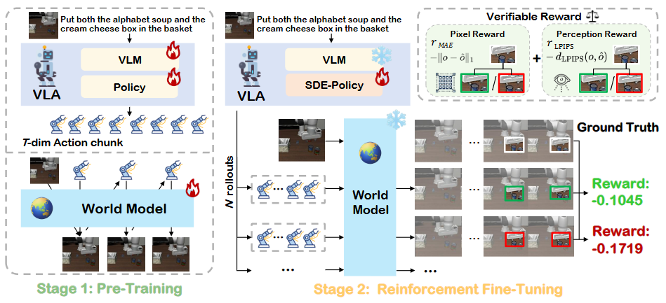

# VLA-RFT: Vision-Language-Action Reinforcement Fine-tuning with Verified Rewards in World Simulators

大部分内容来源于alphaxiv



看这篇VLA-RFT论文，主要贡献如下：

## 核心贡献

**1. 新颖的强化微调框架**
论文提出了VLA-RFT，这是一种新的后训练范式，利用数据驱动的世界模型作为可控模拟器进行强化学习。这种方法在模仿学习和强化学习之间架起了桥梁，同时避免了真实世界交互的成本和风险。

**2. 极高的样本效率**
该方法实现了显著的效率提升，仅需**400次微调迭代**就超越了需要150,000次迭代的强监督基线。这相当于训练步数**减少约375倍**，同时还获得了更好的性能。

**3. 可验证奖励机制**
框架引入了"可验证奖励"系统：
- 使用世界模型根据策略动作生成预测的未来视觉轨迹
- 将这些轨迹与目标达成的参考轨迹进行比较
- 提供密集的轨迹级反馈，结合像素级（L1损失）和感知级（LPIPS）奖励
- 确保动作对齐的学习信号，无需手动设计奖励函数

**4. 基于SDE的策略形式**
论文通过引入Sigma网络，将流匹配策略扩展为随机微分方程(SDE)形式，实现了：
- 为策略梯度正确计算对数似然
- 通过受控随机性在训练期间进行探索
- 通过GRPO（广义强化策略优化）实现稳定优化

**5. 增强的鲁棒性**
VLA-RFT在分布偏移情况下表现出强鲁棒性，在以下扰动测试中保持稳定性能：
- 物体位置扰动（±2.5厘米到±5厘米）
- 目标位置扰动
- 机器人状态扰动
- 组合扰动

该方法在扰动设置下相比基线提升**4-7%**，更广泛的动作分布使其具有更好的适应性。

**6. 全面的实证验证**
论文在LIBERO基准上提供了广泛的实验，显示：
- **91.1%的平均成功率**，而基础模型为86.6%
- 在LIBERO的所有四个套件（Spatial、Object、Goal、Long）上都有一致提升
- 与离线RL和在线RL方法相比具有竞争力或更优的性能
- 通过消融研究证明世界模型是关键组件

这项工作确立了基于世界模型的强化微调作为提高VLA模型泛化能力和鲁棒性的实用且高效范式。

**总结来说，最大的创新点是：**
- ✅ 用数据驱动的世界模型替代真实环境或传统模拟器
- ✅ 实现了极其高效的训练（400步 vs 150k步）
- ✅ 设计了基于视觉轨迹对比的可验证奖励机制
- ✅ 在标准和扰动场景下都显著提升了性能和鲁棒性

## VLA-RFT 方法流程详解


论文的方法分为**两个阶段**：预训练阶段和强化微调阶段。

### 阶段一：预训练（Stage I）

#### 1.1 世界模型预训练
**目标**：让世界模型学习环境动态，能够根据动作预测未来画面

**输入**：
- 初始图像 $o_i$
- 动作序列 $a_{i:i+T-1}$（T帧）

**训练方式**：
- 使用自回归Transformer架构（138M参数，类似GPT-2 small）
- 图像通过编码器转为图像token
- 连续动作离散化为动作token
- 最大似然训练目标：

$$\mathcal{L}^{WM}_{MLE} = -\mathbb{E}\left[\log p_\phi(o_{i+1}|o_i, a_i) + \sum_{t=1}^{T-1}\log p_\phi(o_{i+t+1}|o_{i:i+t}, a_{i:i+t})\right]$$

**训练配置**：
- 在LIBERO数据集上训练150k步
- batch size: 16
- 学习率: 5×10⁻⁵

#### 1.2 VLA策略预训练
**目标**：确保VLA能产生稳定的动作序列

**架构**：
- 上层：视觉-语言模型（VLM）编码多模态输入
- 下层：流匹配（Flow Matching）动作头生成动作chunk

**训练目标**：
$$\mathcal{L}^{VLA}_{MSE}(\theta) = \mathbb{E}\left[\|v_\theta(o_i, l_i, s_i, a^\tau_{i:i+T-1}) - u_\tau\|^2_2\right]$$

其中：
- $\tau \sim \text{Beta}(\alpha, \beta)$：流匹配时间步
- $a^\tau = \tau a + (1-\tau)\epsilon$：噪声扰动的动作
- $u_\tau = a - \epsilon$：目标流场

**训练配置**：
- 在专家演示数据集D上训练
- 使用LoRA微调VLM（rank=64）
- 完全训练动作头

---

### 阶段二：强化微调（Stage II）

这是核心创新阶段，包含四个关键步骤：

#### 2.1 SDE策略：引入随机性

**问题**：流匹配是确定性ODE过程，难以直接计算对数似然

**解决方案**：引入Sigma网络，将策略扩展为随机微分方程(SDE)

**采样过程**（K=10步离散化）：
```
初始化：a⁰ ~ N(0, I)
对于k=1到K：
    1. 流匹配头预测流向：μₖ = aᵏ⁻¹ + δ·v_θ(...)
    2. Sigma网络输出方差：σₖ = σ_ψ(zᵢ, sᵢ, k)
    3. 从高斯分布采样：aᵏ ~ N(μₖ, σₖ²)
```

**对数概率计算**：
$$\bar{\ell}_{\theta,\psi} = \frac{1}{K}\sum_{k=1}^K \log p^{(k)}_{\theta,\psi}(a^{k\delta}|a^{(k-1)\delta}, z_i, s_i)$$

**策略比率**（用于GRPO）：
$$r = \exp(\bar{\ell}_{\theta,\psi} - \bar{\ell}_{old})$$

### 2.2 世界模型交互式模拟

**过程**：给定策略生成的动作chunk $a^{K\delta}_{i:i+T-1}$，世界模型自回归生成未来视觉轨迹

**第一步预测**（从真实初始帧）：
$$\hat{o}_{i+1} = g_\phi(o_i, a^{K\delta}_i)$$

**后续预测**（自回归，基于之前生成的帧）：
$$\hat{o}_{i+t+1} = g_\phi(o_{i:i+t}, a^{K\delta}_{i:i+t}), \quad t=1,\ldots,T-1$$

**生成的完整轨迹**：
$$\text{Traj} = [o_i, a^{K\delta}_i, \hat{o}_{i+1}, \ldots, a^{K\delta}_{i+T-1}, \hat{o}_{i+T}]$$

#### 2.3 可验证奖励计算

**核心思想**：将预测轨迹与真实专家轨迹在视觉空间对比

**奖励函数**（结合像素和感知两个层面）：
$$R = -\sum_{t=0}^{T-1}\left[\lambda_1 \cdot L_1(\hat{o}_{i+t+1}, o_{i+t+1}) + \lambda_{lp} \cdot \text{LPIPS}(\hat{o}_{i+t+1}, o_{i+t+1})\right]$$

其中：
- $L_1$：像素级重建损失
- LPIPS：感知相似度损失（使用预训练特征）
- 奖励越高表示策略动作越接近专家行为

**方差减少**：对N个rollout计算组平均作为baseline
$$\bar{R}_{group} = \frac{1}{N}\sum_{j=1}^N R_j, \quad \text{Adv}_n = R_n - \bar{R}_{group}$$

### 2.4 GRPO策略优化

**最终优化目标**：
$$\mathcal{L}^{VLA}_{GRPO}(\theta, \psi) = -\mathbb{E}[\text{clip}(r, 1-\epsilon, 1+\epsilon) \cdot \text{Adv}] + \lambda_{mse}\mathcal{L}^{VLA}_{MSE}(\theta) - \alpha \mathcal{H}(\pi_{\theta,\psi})$$

**三个组件**：
1. **GRPO主损失**：clip(r, 1-ε, 1+ε)·Adv
   - 使用裁剪的策略比率防止过大更新
   - 基于优势函数引导优化方向

2. **辅助MSE损失**：λ_mse·L^VLA_MSE
   - 保持与专家数据的对齐
   - 防止策略崩溃
   - 权重λ_mse = 0.01

3. **熵正则化**：-α·H(π)
   - 鼓励探索
   - 权重α = 0.003

**训练配置**：
- 仅更新400步（相比预训练的150k步）
- batch size: 16
- 每个更新使用16个rollout
- 学习率: 1×10⁻⁶（流匹配头），1×10⁻⁵（Sigma网络）
- 冻结VLM，仅更新动作头和Sigma网络

---

### 完整流程图

```
┌─────────────────────────────────────────────────────────┐
│              阶段一：预训练（150k步）                      │
├─────────────────────────────────────────────────────────┤
│  世界模型 ← 离线数据 → 学习环境动态                        │
│  VLA策略  ← 专家演示 → 学习稳定动作生成                    │
└─────────────────────────────────────────────────────────┘
                            ↓
┌─────────────────────────────────────────────────────────┐
│            阶段二：强化微调（400步）                        │
├─────────────────────────────────────────────────────────┤
│  输入：初始图像 + 语言指令 + 机器人状态                     │
│         ↓                                                │
│  1. SDE-Policy生成N个动作rollout（带随机性）              │
│         ↓                                                │
│  2. 世界模型模拟：动作 → 预测视觉轨迹                      │
│         ↓                                                │
│  3. 计算可验证奖励：预测轨迹 vs 真实轨迹                   │
│         ↓                                                │
│  4. GRPO优化：更新策略参数                                │
└─────────────────────────────────────────────────────────┘
```

### 关键创新点总结

1. **世界模型作为模拟器**：避免真实环境交互，安全且高效
2. **视觉轨迹对比奖励**：密集、可验证、无需手动设计
3. **SDE扩展**：为流匹配策略引入必要的随机性
4. **极致效率**：400步达到超越150k步监督学习的效果


## VLA-RFT 实验任务详解


论文主要在 **LIBERO 基准测试**上进行实验，这是一个用于评估机器人终身学习和知识迁移的基准。

### 一、LIBERO 标准任务套件

#### 1. LIBERO-Spatial（空间关系任务）
- **特点**：测试对空间关系的理解（如"上方"、"左边"等）
- **示例任务**：
  - 将物体放在某个位置的上方/下方
  - 在特定空间配置下操作物体
- **成功率**：88.4%（基线）→ **94.4%**（VLA-RFT，+6.0%）

#### 2. LIBERO-Object（物体泛化任务）
- **特点**：测试对不同物体的泛化能力
- **示例任务**：
  - 操作不同形状、颜色的物体
  - 将多种物体放入容器
- **成功率**：88.0%（基线）→ **94.4%**（VLA-RFT，+6.4%）

#### 3. LIBERO-Goal（目标泛化任务）
- **特点**：测试对不同目标位置的适应
- **示例任务**：
  - 将物体放到不同的目标位置
  - 适应目标配置的变化
- **成功率**：92.8%（基线）→ **95.4%**（VLA-RFT，+2.6%）

#### 4. LIBERO-Long（长时序任务）
- **特点**：测试长时间跨度的任务执行
- **示例任务**：
  - 多步骤操作序列
  - 需要长期规划的复杂任务
- **成功率**：77.2%（基线）→ **80.2%**（VLA-RFT，+3.0%）

**平均成功率**：86.6% → **91.1%**（+4.5%）

---

### 二、扰动鲁棒性测试（核心创新实验）

论文设计了系统的扰动实验来测试分布偏移下的鲁棒性：

#### 2.1 物体位置扰动（Object Position Perturbation）
**设置**：改变被操作物体的初始(x, y)坐标

| 扰动程度 | 范围 | 基线成功率 | VLA-RFT | 提升 |
|---------|------|-----------|---------|------|
| 轻微扰动 | ±2.5cm | 69.3% | **73.5%** | +4.2% |
| 重度扰动 | ±5cm | 48.0% | **52.5%** | +4.5% |

**示例**：
- 原始：字母汤罐头在桌面中心
- 扰动：罐头向左/右偏移2.5-5厘米

#### 2.2 目标位置扰动（Goal Position Perturbation）
**设置**：改变目标物体的位置

| 扰动程度 | 范围 | 基线成功率 | VLA-RFT | 提升 |
|---------|------|-----------|---------|------|
| 轻微扰动 | ±2.5cm | 74.5% | **79.0%** | +4.5% |
| 重度扰动 | ±5cm | 44.8% | **51.5%** | +6.7% |

**示例**：
- 原始："把物体放进篮子"，篮子在固定位置
- 扰动：篮子位置偏移2.5-5厘米

#### 2.3 机器人状态扰动（Robot State Perturbation）
**设置**：改变机械臂的初始高度和水平偏移

| 扰动程度 | 范围 | 基线成功率 | VLA-RFT | 提升 |
|---------|------|-----------|---------|------|
| 轻微扰动 | ±20（单位未明确） | 73.0% | **76.5%** | +2.5% |
| 重度扰动 | ±50 | 63.5% | **67.0%** | +3.5% |

**示例**：
- 调整夹爪的垂直高度
- 改变机械臂的水平偏移

#### 2.4 组合扰动（Combined Perturbation）
**设置**：同时应用物体位置、目标位置和机器人状态扰动

| 扰动程度 | 范围 | 基线成功率 | VLA-RFT | 提升 |
|---------|------|-----------|---------|------|
| 轻微扰动 | ±2.5/±2.5/±20 | 63.5% | **70.0%** | +6.5% |
| 重度扰动 | ±5/±5/±50 | 34.0% | **37.0%** | +3.0% |

**关键发现**：
- 组合扰动下提升最明显（+6.5%）
- 证明VLA-RFT在复杂分布偏移下更鲁棒

---

### 三、消融实验：奖励设计对比

测试三种不同的奖励机制：

#### 奖励类型1：动作级监督
- **方法**：直接比较策略动作与专家动作的L1距离
- **公式**：$R_1 = -\|a_{policy} - a_{expert}\|_1$
- **结果**：87.7%（+1.1%）
- **结论**：⚠️ 不使用世界模型，提升有限

#### 奖励类型2：单向视觉对比
- **方法**：世界模型生成图像，与真实图像对比
- **公式**：$R_2 = -[\text{MAE}(\hat{o}, o) + \text{LPIPS}(\hat{o}, o)]$
- **结果**：87.1%（+0.5%）
- **问题**：⚠️ 受世界模型生成质量偏差影响

#### 奖励类型3：双向公平对比（论文方法）
- **方法**：策略动作和专家动作都通过世界模型生成，在相同生成空间对比
- **公式**：
  - 策略轨迹：WM(策略动作) → $\hat{o}_{policy}$
  - 专家轨迹：WM(专家动作) → $\hat{o}_{expert}$
  - 奖励：$R_3 = -[\text{MAE}(\hat{o}_{policy}, \hat{o}_{expert}) + \text{LPIPS}(\hat{o}_{policy}, \hat{o}_{expert})]$
- **结果**：**91.1%**（+4.5%）
- **优势**：✅ 消除生成质量偏差，公平比较

---

### 四、与其他方法的对比实验

#### 4.1 与其他VLA方法对比

在LIBERO四个套件上的排名：

| 方法 | Spatial | Object | Goal | Long | 平均 | 排名 |
|-----|---------|--------|------|------|------|------|
| **VLA-RFT（本文）** | 94.4 | 94.4 | 95.4 | 80.2 | **91.1** | 🥇 1 |
| π0 | 91.2 | 93.2 | 93.8 | 74.2 | 88.1 | 🥈 2 |
| VLA-Adapter（基线） | 88.4 | 88.0 | 92.8 | 77.2 | 86.6 | 🥉 3 |
| WorldVLA | 87.6 | 96.2 | 83.4 | 60.0 | 81.8 | 4 |
| CoT-VLA | 87.5 | 91.6 | 87.6 | 69.0 | 81.1 | 5 |

#### 4.2 与其他RL方法对比

| 类型 | 方法 | 基线 | 微调后 | 提升 | 训练步数 |
|------|-----|------|--------|------|---------|
| 在线RL | VLA-RL | 76.5% | 81.0% | +4.5% | 10,000 |
| 离线RL | ARFM | 88.1% | 92.1% | +4.0% | 40,000 |
| 离线RL | RWR | 88.1% | 90.8% | +2.7% | 40,000 |
| 离线RL | ReinboT | 88.1% | 91.2% | +3.1% | 40,000 |
| **本文** | **VLA-RFT** | 86.6% | **91.1%** | **+4.5%** | **400** ✨ |

**关键发现**：
- ✅ 性能与在线RL相当（+4.5% vs +4.5%）
- ✅ 超越所有离线RL方法
- ✅ **训练步数仅为其他方法的1/25到1/100**

---

### 五、世界模型质量评估

**任务**：评估世界模型生成未来帧的准确性

**测试方法**：
- 输入：初始真实图像 + 完整动作序列
- 输出：预测的后续帧
- 对比：与真实帧比较

**结果**（平均值）：

| 指标 | 数值 | 说明 |
|-----|------|------|
| MSE ↓ | 0.0039 | 像素误差（越低越好）|
| PSNR ↑ | 25.23 dB | 峰值信噪比（越高越好）|
| SSIM ↑ | 0.906 | 结构相似度（越高越好）|
| LPIPS ↓ | 0.059 | 感知距离（越低越好）|

**结论**：世界模型能够高保真地预测未来视觉状态，捕捉静态背景和动作驱动的变化

---

### 六、具体任务示例

论文在图4中展示的具体任务：

#### 示例1：Put both the alphabet soup and the cream cheese box in the basket
- **任务类型**：多物体操作 + 目标放置
- **挑战**：需要顺序操作两个物体
- **扰动测试**：物体初始位置、篮子位置、机械臂姿态

#### 示例2：视觉对比
论文展示了：
- **原始场景**：标准配置
- **扰动场景**：各种位置偏移
- **执行对比**：
  - 基线：遇到扰动后失败（红框标记）
  - VLA-RFT：能够重新捕获物体并成功完成（绿框标记）

---

### 实验总结

#### 实验规模
- ✅ **4个标准任务套件**（LIBERO-Spatial/Object/Goal/Long）
- ✅ **12种扰动设置**（3种扰动类型 × 2种强度 × 2个任务）
- ✅ **3种奖励设计消融**
- ✅ **与10+种VLA方法对比**
- ✅ **与4种RL方法对比**

#### 核心发现
1. 🎯 标准任务上全面领先（91.1% 平均成功率，排名第1）
2. 💪 扰动鲁棒性显著提升（最高+6.7%）
3. ⚡ 训练效率极高（400步 vs 10k-40k步）
4. 🔑 世界模型是关键组件（消融实验证明）