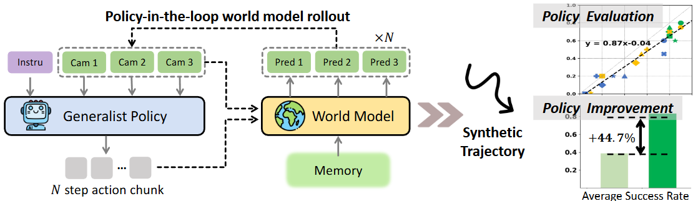
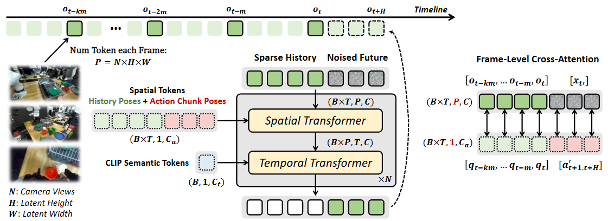

# Ctrl-World: A Controllable Generative World Model for Robot Manipulation
大部分内容来源于alphaxiv





## **CTRL-WORLD** 的主要贡献包括：

### 1. **首个支持现代VLA策略闭环交互的可控世界模型**

这是第一个能够与最先进的视觉-语言-动作(VLA)策略进行策略在环(policy-in-the-loop)多步rollout的世界模型，实现了完全在想象空间中的交互。

### 2. **三个关键技术创新**

- **多视角联合预测**：同时预测多个摄像头视角(包括第三人称和手腕视角)，提供更全面的场景理解，显著减少了物体交互时的幻觉现象

- **帧级动作条件化**：通过帧级别的精细动作控制，确保生成的rollout准确反映每个动作的因果效应，实现厘米级的控制精度

- **姿态条件化的记忆检索机制**：通过稀疏历史帧和姿态信息投影，使模型能够关注相似的过去状态，保持长时域(20秒以上)的时空一致性

### 3. **双重应用价值**

#### **策略评估**
- 无需真实机器人rollout即可准确评估策略性能
- 想象空间中的策略排名与真实世界高度对齐(指令跟随相关性: y = 0.87x - 0.04)

#### **策略改进**
- 通过在世界模型中合成成功轨迹并用于监督微调
- 将π0.5-DROID策略在新指令上的成功率从38.7%提升至83.4%(**+44.7%**)

### 4. **强泛化能力**

- 在DROID数据集(95k轨迹，564个场景)上训练
- 零样本泛化到全新场景和摄像头位置
- 在新环境中生成超过20秒的时空一致轨迹

这项工作为机器人学习提供了一个可扩展的评估和改进范式，使机器人不仅能从真实经验中学习，还能从想象空间生成的合成经验中安全高效地学习。

***


## 整体架构概览

```
┌─────────────────────────────────────────────────────────────┐
│                    CTRL-WORLD 工作流程                        │
│  阶段1: 世界模型训练 → 阶段2: 策略评估 → 阶段3: 策略改进      │
└─────────────────────────────────────────────────────────────┘
```

---

### **阶段1：世界模型离线训练**

#### **1.1 数据准备**

```
数据集：DROID Dataset
- 95,599 条轨迹
- 564 个不同场景
- ~76k 成功轨迹 + ~19k 失败轨迹
- 包含多样化的动作和失败案例（对训练可控世界模型至关重要）
```

#### **1.2 训练过程**

```
┌──────────────────────────────────────────────────────┐
│  输入数据采样                                          │
│  - 随机选择一条轨迹                                    │
│  - 均匀采样当前帧 o_t                                  │
│  - 回溯采样7个历史帧（间隔1-2秒）                      │
│  - 提取未来15步动作和对应的未来帧                      │
└──────────────────────────────────────────────────────┘
                        ↓
┌──────────────────────────────────────────────────────┐
│  多视角编码                                            │
│  - 3个摄像头视角（2个第三人称 + 1个手腕）              │
│  - VAE编码：192×320 → 24×40 潜在特征                  │
│  - 拼接tokens：3 × 24 × 40 = 2,880 tokens/帧          │
└──────────────────────────────────────────────────────┘
                        ↓
┌──────────────────────────────────────────────────────┐
│  条件信息准备                                          │
│  - 历史姿态：[q_{t-7m}, ..., q_t]                     │
│  - 动作序列：[a_{t+1:t+15}] → 姿态 [a'_{t+1:t+15}]   │
│  - 历史帧添加独立噪声                                  │
└──────────────────────────────────────────────────────┘
                        ↓
┌──────────────────────────────────────────────────────┐
│  扩散模型训练                                          │
│  - 未来帧加噪：x_{t'} = √α_{t'}·x_0 + √(1-α_{t'})·ε │
│  - 模型输入：[历史帧(7) + 加噪未来帧(5)]               │
│  - 空间Transformer：逐帧交叉注意力（姿态条件化）       │
│  - 时间Transformer：帧间时序建模                       │
│  - 损失：L = ||x̂_0 - x_0||²                          │
└──────────────────────────────────────────────────────┘

训练配置：
- 2×8 H100 GPUs
- Batch size: 64
- 学习率: 1e-5
- 训练100k步（2-3天）
```

---

### **阶段2：策略在环评估**

#### **2.1 设置初始状态**

```
场景准备：
- 搭建全新的DROID平台（未在训练数据中出现）
- 随机放置2个第三人称摄像头
- 准备评估任务：Pick-Place, Fold-Towel, Drawer, 
  Wipe-Table, Close-Laptop, Pull-Tissue, Stack
- 捕获初始观测 o_0（3个视角的图像 + 机器人姿态）
```

#### **2.2 策略-世界模型交互循环**

```
┌─────────────────────────────────────────────────────────┐
│  步骤1: 策略推理                                          │
│  输入: o_t（当前观测）, l（语言指令）                     │
│  输出: a^{jv}_{t+1:t+H}（H步关节速度）                   │
│                                                           │
│  π_{0.5}(q^{joint}_t, o_t, l) → a^{jv}_{t+1:t+H}       │
└─────────────────────────────────────────────────────────┘
                        ↓
┌─────────────────────────────────────────────────────────┐
│  步骤2: 动作空间转换（通过Adapter）                       │
│                                                           │
│  关节速度 → 关节配置                                      │
│  q^{joint}_{t+1:t+H} = Adapter(q^{joint}_t, a^{jv})     │
│                                                           │
│  关节配置 → 笛卡尔姿态（前向运动学）                      │
│  q^{cartesian}_{t+1:t+H} = FK(q^{joint}_{t+1:t+H})      │
└─────────────────────────────────────────────────────────┘
                        ↓
┌─────────────────────────────────────────────────────────┐
│  步骤3: 世界模型预测                                      │
│  输入:                                                    │
│  - 当前观测: o_t                                          │
│  - 历史上下文: [o_{t-7m}, ..., o_{t-m}]                  │
│  - 历史姿态: [q^{cartesian}_{t-7m}, ..., q^{cartesian}_t]│
│  - 未来姿态: q^{cartesian}_{t+1:t+H}                     │
│                                                           │
│  输出: ô_{t+1:t+H}（预测的未来观测，3个视角）             │
│                                                           │
│  W(o_t, q^{cartesian}_{t+1:t+H}, history) → ô_{t+1:t+H} │
└─────────────────────────────────────────────────────────┘
                        ↓
┌─────────────────────────────────────────────────────────┐
│  步骤4: 更新状态，进入下一轮                              │
│  o_{t+H} ← ô_{t+H}（取最后一帧作为新的当前观测）         │
│  重复步骤1-4，进行N轮交互（N=20，总时长~20秒）            │
└─────────────────────────────────────────────────────────┘
                        ↓
┌─────────────────────────────────────────────────────────┐
│  步骤5: 轨迹评估                                          │
│  - 人工判断指令跟随率（是否尝试正确的动作）               │
│  - 人工判断任务成功率（是否完成任务目标）                 │
└─────────────────────────────────────────────────────────┘
```

#### **2.3 评估结果**

```
策略性能相关性（想象空间 vs 真实世界）：
- 指令跟随率: y = 0.87x - 0.04（高度对齐）
- 任务成功率: y = 0.81x - 0.11（存在系统性低估）

零样本泛化能力：
✓ 新场景布局
✓ 新摄像头位置
✓ 20秒以上长时域一致性
```

---

### **阶段3：基于合成数据的策略改进**

#### **3.1 识别策略弱点**

```
通过阶段2的评估，发现π_{0.5}基础策略的薄弱环节：
- 空间理解差（"pick the object on the left"）
- 形状区分弱（"pick the larger block"）
- 方向理解不准（"fold from left to right"）
- 新物体识别差（glove, stapler等未见物体）
```

#### **3.2 多样化轨迹生成**

```
┌─────────────────────────────────────────────────────────┐
│  策略A: 指令改写                                          │
│  原始: "place glove in box"                              │
│  改写: "pick up the cloth and put it inside the box"     │
│       "put the hand covering into the container"         │
│  (使用LLM API生成多个改写版本)                            │
└─────────────────────────────────────────────────────────┘
                        ↓
┌─────────────────────────────────────────────────────────┐
│  策略B: 初始状态重置                                      │
│  - 在世界模型中随机采样新的初始机器人位置                 │
│  - 使用线性插值规划器移动到该位置                         │
│  - 从新位置开始交互                                       │
└─────────────────────────────────────────────────────────┘
                        ↓
┌─────────────────────────────────────────────────────────┐
│  批量生成轨迹                                             │
│  for 每个任务:                                            │
│    生成 400 条轨迹                                        │
│    - 使用策略A和B增加多样性                               │
│    - 策略与世界模型交互N=20步                             │
│    - 每条轨迹~20秒                                        │
└─────────────────────────────────────────────────────────┘
```

#### **3.3 人工筛选成功轨迹**

```
┌─────────────────────────────────────────────────────────┐
│  人工评估标准（每个任务）                                 │
│                                                           │
│  空间理解任务:                                            │
│  ✓ 是否抓取了正确位置的物体                               │
│  ✓ 是否成功放入目标容器                                   │
│                                                           │
│  形状理解任务:                                            │
│  ✓ 是否区分了大小/形状                                    │
│  ✓ 是否抓取了正确的物体                                   │
│                                                           │
│  方向理解任务:                                            │
│  ✓ 折叠方向是否正确                                       │
│  ✓ 毛巾面积是否减半                                       │
│                                                           │
│  新物体任务:                                              │
│  ✓ 是否识别并抓取了未见物体                               │
│  ✓ 是否完成了放置任务                                     │
└─────────────────────────────────────────────────────────┘
                        ↓
筛选结果：每个任务保留 25-50 条成功轨迹
总计：~100-200 条高质量合成数据
```

#### **3.4 监督微调**

```
┌─────────────────────────────────────────────────────────┐
│  微调设置                                                 │
│  - 基础模型: π_{0.5}-DROID 预训练checkpoint              │
│  - 训练数据: 合成成功轨迹数据集 D_s                       │
│  - 损失函数: L = E||π_θ(o_t, l) - a_{t:t+H}||²          │
│  - 硬件: 4×H100 GPUs                                     │
│  - 训练步数: 2,000 steps                                 │
└─────────────────────────────────────────────────────────┘
                        ↓
┌─────────────────────────────────────────────────────────┐
│  微调后性能提升                                           │
│                                                           │
│  任务类型          基础策略  →  微调后    提升            │
│  ────────────────────────────────────────────────        │
│  空间理解           28.8%   →   87.5%   (+58.7%)        │
│  形状理解           43.7%   →   91.3%   (+47.6%)        │
│  方向理解           57.5%   →   80.0%   (+22.5%)        │
│  新物体识别         25.0%   →   75.0%   (+50.0%)        │
│  ────────────────────────────────────────────────        │
│  平均成功率         38.7%   →   83.4%   (+44.7%)        │
└─────────────────────────────────────────────────────────┘
```

---

### **关键技术时间线总结**

```
时间线:

T0: 离线训练世界模型（2-3天）
    └── 95k DROID轨迹 → 可控多视角世界模型

T1: 零样本部署到新环境
    └── 无需任何微调，直接在新场景工作

T2: 策略评估（数小时）
    └── 在想象空间中运行3个策略×7个任务
    └── 替代数周的真实机器人实验

T3: 发现策略弱点
    └── 通过评估结果分析失败模式

T4: 生成合成数据（数小时）
    └── 400轨迹/任务 → 筛选出25-50条成功轨迹

T5: 策略微调（数小时）
    └── 2k步微调 → 性能提升44.7%

T6: 真实世界验证
    └── 确认改进效果在真实机器人上有效
```

---

### **工作流程的核心优势**

1. **可扩展性**：世界模型训练一次，可重复用于评估和改进
2. **安全性**：所有探索在想象空间进行，无物理风险
3. **效率性**：评估和数据生成比真实机器人快数个数量级
4. **零样本泛化**：训练好的模型可直接应用于新场景
5. **闭环迭代**：评估→发现问题→生成数据→改进→再评估

这种工作流程展示了**世界模型作为机器人学习基础设施**的潜力，使得策略开发可以像软件开发一样快速迭代。

***


## CTRL-WORLD的世界模型构建
### 1. **基础架构**

**初始化**：
- 基于预训练的**Stable Video Diffusion (SVD) 1.5B**模型
- 采用时空Transformer架构（Spatial-Temporal Transformers）
- 唯一新增的组件是一个**3层MLP**，将7维笛卡尔空间动作投影到1024维潜在嵌入

**编码器**：
- 使用VAE编码器，空间下采样比例为8×8
- 输入图像分辨率：192×320（每个摄像头）
- 编码后的潜在特征形状：24×40

### 2. **三大核心机制**

#### **(1) 多视角联合预测 (Multi-View Joint Predictions)**

```
输入：N个摄像头视角（3个：2个第三人称 + 1个手腕视角）
处理：沿token维度拼接所有视角的图像
       每个帧包含 3 × 24 × 40 个tokens
输出：联合预测所有视角的未来帧 o_{t+1:t+H}
```

#### **(2) 姿态条件化的记忆检索 (Pose-conditioned Memory Retrieval)**

```
历史帧采样：
- k = 7 个历史帧
- 采样间隔 m = 1-2秒
- 每个历史帧独立添加随机噪声（提高鲁棒性）

姿态嵌入：
- 将机器人手臂姿态 [q_{t-km}, ..., q_t] 嵌入到对应的历史帧中
- 通过空间Transformer中的逐帧交叉注意力机制实现
- 允许模型利用姿态信息检索相关历史状态
```

#### **(3) 帧级动作条件化 (Frame-level Action Conditioning)**

```
动作处理：
- 条件化窗口：15步动作（对应1秒的action chunk）
- 动作转换：Cartesian空间动作 → 机器人手臂姿态 [a'_{t+1:t+H}]
- 时间下采样：15步 → 5步（降低GPU内存消耗）

姿态拼接：
- 历史姿态：[q_{t-km}, ..., q_{t-m}, q_t]
- 未来姿态：[a'_{t+1:t+H}]
- 通过空间Transformer中的逐帧交叉注意力条件化
```

### 3. **训练细节**

**训练目标**（扩散损失）：

$$\mathcal{L} = \mathbb{E}_{x_0, \epsilon, t'} \|\hat{x}_0(x_{t'}, t', c) - x_0\|^2$$

其中：
- $x_0 = o_{t+1:t+H}$ （预测目标）
- $x_{t'} = \sqrt{\alpha_{t'}}x_0 + \sqrt{1-\alpha_{t'}}\epsilon_{t'}$ （加噪后的数据）
- $c = [q_{t-km}, ..., q_t, a'_{t+1:t+H}, o_{t-km}, ..., o_t]$ （所有条件输入）

**模型输入组成**：
- 历史tokens + 加噪的未来tokens
- 总输入形状：$B \times (7+5) \times (3 \times 24 \times 40)$
  - 7个历史帧 + 5个未来帧
  - 每帧3个视角

**训练配置**：
- 硬件：2×8 H100 GPUs
- Batch size：64
- 学习率：1e-5
- 训练步数：100k步
- 训练时长：约2-3天
- 数据集：DROID全部95k轨迹

### 4. **与策略的交互机制**

为了弥合VLA策略和世界模型之间的差异，论文训练了一个**适配器(Adapter)**：

```
策略输出：关节速度 a^{jv}_{t+1:t+H} = π(q^{joint}_t, o_t, l)

Adapter转换：
q^{joint}_{t+1:t+H} = Adapter(q^{joint}_t, a^{jv}_{t+1:t+H})

前向运动学(FK)：
q^{cartesian}_{t+1:t+H} = FK(q^{joint}_{t+1:t+H})

世界模型预测：
o_{t+1:t+H} = WM(o_t, q^{cartesian}_{t+1:t+H}, q^{cartesian}_{history})
```

这种设计使得官方的π0、π0-FAST和π0.5策略可以直接与Ctrl-World无缝交互，实现完全自回归的想象空间rollout。


## 如何利用世界模型提升策略
根据论文，世界模型用于策略改进的完整流程如下：

### 1. **策略改进的核心思路**

利用世界模型在想象空间中合成成功的轨迹，然后用这些合成数据对策略进行监督微调，从而提升策略在新指令和新物体上的表现。

### 2. **完整算法流程** (Algorithm 1)

#### **第一阶段：在世界模型中生成多样化轨迹**

```
输入：
- 策略 π_θ
- 世界模型 W
- 下游任务指令 [l^0, ..., l^M]
- 对应的初始观测 [o^0_0, ..., o^M_0]
- 交互步数 N，动作horizon H

过程：
for 每个任务 i = 0 to M:
    初始化轨迹 τ = [o^i_0]
    
    for 交互步 j = 0 to N:
        # 从策略采样动作（带扰动以增加多样性）
        a_{t+1:t+H} = π_θ(o_t, l, ε_a)  
        
        # 准备历史上下文
        h = [o_{t-km}, ..., o_{t-2m}, o_{t-m}]
        
        # 世界模型预测未来帧
        o_{t+1:t+H} = W(h, o_t, a_{t+1:t+H})
        
        # 添加到轨迹
        τ = τ ∪ o_{t+1:t+H}
    
    # 人工判断轨迹是否成功
    if 轨迹成功:
        添加到合成数据集 D_s
```

#### **第二阶段：用合成数据微调策略**

```
损失函数：
L_θ = E_{o_t, a_{t:t+H} ~ D_s} ||π_θ(o_t, l) - a_{t:t+H}||^2

微调配置：
- 基础策略：π_{0.5}-DROID
- 微调步数：2k steps
- 硬件：4×H100 GPUs
```

### 3. **增加轨迹多样性的两种策略**

论文观察到**策略行为高度确定性**（例如总是抓取同一个物体），为了探索更大的搜索空间，采用两种扰动方法：

#### **(1) 指令改写 (Instruction Rephrasing)**

```
原始指令："place glove in box"
改写指令："pick up the cloth and put it inside the box"

原理：VLA策略对不同指令表述敏感，会展现不同行为
实现：调用LLM API (如Gemini) 进行指令改写
```

#### **(2) 初始状态重置 (Initial State Resetting)**

```
过程：
1. 在世界模型中随机采样新的目标初始位置
2. 使用线性插值运动规划器移动机器人手臂到该位置
3. 从新位置开始策略交互

效果：产生不同的初始观测，导致多样化的rollout
```

### 4. **具体实验设置**

#### **任务类型**

论文针对π_{0.5}基础策略的薄弱环节设计了4类任务：

| 任务类型 | 示例指令 | 目的 |
|---------|---------|------|
| **空间理解** | "Pick the object in the top left corner" | 测试空间定位能力 |
| **形状理解** | "Pick the larger green object" | 测试尺寸/形状区分 |
| **方向理解** | "Fold the towel from right to left" | 测试方向理解 |
| **新物体** | "Pick the glove and place in box" | 测试对未见物体的泛化 |

#### **数据生成量**

```
每个任务：生成 400 条轨迹
人工筛选：保留 25-50 条成功轨迹
总计：约 100-200 条高质量合成轨迹用于微调
```

### 5. **改进效果**

#### **整体性能提升**

```
任务类别              基础策略    微调后策略    提升幅度
空间理解               28.8%      87.5%      +58.7%
形状理解               43.7%      91.3%      +47.6%
毛巾折叠方向            57.5%      80.0%      +22.5%
新物体                 25.0%      75.0%      +50.0%
----------------------------------------------------
平均成功率             38.7%      83.4%      +44.7%
```

#### **详细任务分解**（以空间理解为例）

| 位置指令 | 基础策略 | 微调后 |
|---------|---------|--------|
| Left | 50% | 85% |
| Right | 45% | 90% |
| Bottom | 30% | 100% |
| Top | 45% | 80% |
| Left Top | 15% | 85% |
| Left Bottom | 20% | 90% |
| Right Top | 5% | 90% |
| Right Bottom | 20% | 80% |

### 6. **关键优势**

1. **无需真实机器人数据收集**：完全在想象空间中生成训练数据
2. **安全高效**：避免了真实机器人失败的风险和时间成本
3. **可扩展性强**：可以大规模生成多样化的合成轨迹
4. **针对性强**：可以针对特定失败模式生成纠正数据

### 7. **局限性**

论文也指出当前方法的局限：

- 主要改进**指令跟随能力**，对已见指令的低级执行成功率提升有限
- 对需要精确交互或长期推理的任务效果较弱
- 性能对初始观测敏感
- 未来可以通过迭代式策略rollout和微调进一步改进

这种基于世界模型的策略改进范式展示了一种新的机器人学习方式：**不仅从真实经验学习，还能从想象空间生成的合成经验中安全高效地学习**。

***

## 实验结果

根据论文，CTRL-WORLD在以下任务上进行了实验：

### **阶段1：世界模型质量验证**

在DROID验证集上测试世界模型的生成质量：

```
评估设置：
- 随机采样256个视频片段
- 每个片段10秒长
- 自回归生成10轮（每轮1秒）
- 与真实轨迹对比
```

---

### **阶段2：策略评估实验**

在**自建的全新DROID平台**上评估3个开源策略：

#### **测试的策略**
- **π0** (Black et al., 2023)
- **π0-FAST** (Pertsch et al., 2025)  
- **π0.5** (Physical Intelligence, 2025)

#### **7类操作任务**

| 任务 | 指令示例 | 评估指标 |
|------|---------|---------|
| **1. Pick-Place** | "Pick up A and place in B" | ✓ 是否抓取正确物体<br>✓ 是否放入目标容器 |
| **2. Fold-Towel** | "Fold the towel" | ✓ 是否移动到毛巾边缘<br>✓ 毛巾面积是否减半 |
| **3. Drawer** | "Place object A into drawer" | ✓ 是否尝试放入抽屉<br>✓ 物体是否最终在抽屉内 |
| **4. Wipe-Table** | "Wipe the table surface" | ✓ 是否用毛巾接触桌面<br>✓ 是否覆盖大部分区域 |
| **5. Close-Laptop** | "Close the laptop" | ✓ 是否接近笔记本盖<br>✓ 盖子是否完全关闭 |
| **6. Pull-Tissue** | "Pull a tissue from the box" | ✓ 是否接近纸巾槽<br>✓ 是否完全抽出纸巾 |
| **7. Stack** | "Stack object A on object B" | ✓ 是否抓取正确物体<br>✓ 是否稳定堆叠 |

#### **评估结果概览**

```
真实世界 vs 世界模型的相关性：

指令跟随率：
π0:       真实0.37 vs 模型0.28
π0-FAST:  真实0.52 vs 模型0.42  
π0.5:     真实0.82 vs 模型0.69
相关性：y = 0.87x - 0.04 ✓ 高度对齐

任务成功率：
π0:       真实0.34 vs 模型0.19
π0-FAST:  真实0.47 vs 模型0.29
π0.5:     真实0.73 vs 模型0.54
相关性：y = 0.81x - 0.11 （存在系统性低估）
```

#### **关键发现**
- 世界模型能**准确排名策略性能**
- 在指令跟随层面对齐度更高
- 在低级执行成功率上略显保守（underestimate）

---

### **阶段3：策略改进实验**

针对**π0.5-DROID基础策略**的薄弱环节设计4类任务：

#### **任务1：空间理解 (Spatial Understanding)**

**场景设置**：2-6个随机物体放在桌面，要求根据空间位置抓取

**8个空间位置指令**：

```
1. "Pick the object on the LEFT and place in box"
2. "Pick the object on the RIGHT and place in box"
3. "Pick the object at the BOTTOM and place in box"
4. "Pick the object at the TOP and place in box"
5. "Pick the object in the TOP-LEFT corner"
6. "Pick the object in the TOP-RIGHT corner"  
7. "Pick the object in the BOTTOM-LEFT corner"
8. "Pick the object in the BOTTOM-RIGHT corner"
```

**结果**：

| 位置 | 基础策略 | 微调后 | 提升 |
|------|---------|--------|------|
| Left | 50% | 85% | +35% |
| Right | 45% | 90% | +45% |
| Bottom | 30% | 100% | +70% |
| Top | 45% | 80% | +35% |
| Left-Top | 15% | 85% | +70% |
| Left-Bottom | 20% | 90% | +70% |
| Right-Top | 5% | 90% | +85% |
| Right-Bottom | 20% | 80% | +60% |
| **平均** | **28.8%** | **87.5%** | **+58.7%** |

---

#### **任务2：形状理解 (Shape Understanding)**

**场景设置**：2-3个物体具有相同颜色但不同尺寸

**4个形状指令**：

```
1. "Pick the LARGER red block and place in box"
2. "Pick the SMALLER red block and place in box"
3. "Pick the BIGGER green object and place in box"
4. "Pick the SMALLER green object and place in box"
```

**结果**：

| 任务 | 基础策略 | 微调后 | 提升 |
|------|---------|--------|------|
| Larger-Left | 40% | 85% | +45% |
| Larger-Right | 45% | 95% | +50% |
| Smaller-Left | 40% | 95% | +55% |
| Smaller-Right | 50% | 90% | +40% |
| **平均** | **43.7%** | **91.3%** | **+47.6%** |

---

#### **任务3：方向理解 (Towel-Folding Direction)**

**场景设置**：桌上有毛巾和干扰物

**4个方向指令**：

```
1. "Fold the towel from LEFT to RIGHT"
2. "Fold the towel from RIGHT to LEFT"
3. "Fold the towel from TOP to BOTTOM"
4. "Fold the towel from BOTTOM to TOP"
```

**结果**：

| 方向 | 基础策略 | 微调后 | 提升 |
|------|---------|--------|------|
| Towel-1 | 60% | 75% | +15% |
| Towel-2 | 50% | 80% | +30% |
| Towel-3 | 55% | 85% | +30% |
| Towel-4 | 65% | 80% | +15% |
| **平均** | **57.5%** | **80.0%** | **+22.5%** |

---

#### **任务4：新物体识别 (Novel Objects)**

**场景设置**：引入训练时未见的物体

**2类新物体任务**：

```
1. "Pick the GLOVE and place in box"
   "Pick up the cloth and put it inside the box"（改写）
   
2. "Pick the STAPLER and place in box"
   "Grasp the office tool and move it to the container"（改写）
```

**结果**：

| 物体 | 基础策略 | 微调后 | 提升 |
|------|---------|--------|------|
| Glove | 20% | 80% | +60% |
| Stapler | 30% | 70% | +40% |
| **平均** | **25.0%** | **75.0%** | **+50.0%** |

---

### **实验总结**

#### **测试的维度**

```
1. 世界模型质量
   ✓ 生成保真度（PSNR, SSIM, LPIPS, FID, FVD）
   ✓ 长时域一致性（10秒自回归生成）
   ✓ 控制精度（厘米级动作差异）

2. 策略评估能力  
   ✓ 3个策略 × 7个任务 = 21个组合
   ✓ 真实世界 vs 想象空间对比
   ✓ 每任务20次rollout

3. 策略改进效果
   ✓ 4个任务类别
   ✓ 总计约20个细分任务
   ✓ 每任务生成400轨迹，筛选25-50个
```

#### **整体性能提升**

```
┌─────────────────────────────────────────────┐
│  策略改进总结（π0.5-DROID）                   │
├─────────────────────────────────────────────┤
│  任务类别          基础  →  微调    提升      │
├─────────────────────────────────────────────┤
│  空间理解         28.8% → 87.5%   +58.7%    │
│  形状理解         43.7% → 91.3%   +47.6%    │
│  方向理解         57.5% → 80.0%   +22.5%    │
│  新物体           25.0% → 75.0%   +50.0%    │
├─────────────────────────────────────────────┤
│  平均成功率       38.7% → 83.4%   +44.7%    │
└─────────────────────────────────────────────┘
```

#### **实验规模**

```
总计评估次数：
- 策略评估：3策略 × 7任务 × 20次 × 2环境(真实+模拟) ≈ 840次
- 策略改进：4类别 × ~5子任务 × 20次 × 2阶段(前后) ≈ 800次
- 轨迹生成：4类别 × 400轨迹 = 1,600条合成轨迹

时间对比：
- 真实机器人评估：预计数周
- 世界模型评估：数小时  
- 效率提升：~100倍
```

这些实验全面验证了CTRL-WORLD在**世界模型质量、策略评估准确性、策略改进有效性**三个方面的能力，证明了基于世界模型的机器人学习范式的可行性。