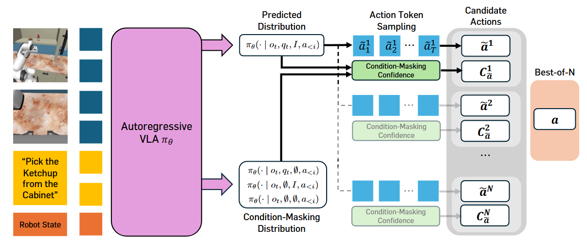

# Verifier-free Test-Time Sampling for Vision Language Action Models
大部分内容来源于alphaxiv

## 核心贡献
**MG-Select (Masking Distribution Guided Selection)** 的主要贡献可以总结为以下几点：

1. **无需外部验证器的测试时扩展框架**
   - 提出了首个针对视觉-语言-动作模型(VLA)的无验证器测试时扩展方法
   - 不需要额外训练外部价值函数或奖励模型
   - 仅利用模型内部信号进行动作选择，避免了外部验证器的泛化问题

2. **条件掩码分布置信度(Condition-Masking Distributional Confidence)**
核心创新在于置信度度量的设计：
   - 使用KL散度衡量预测分布与参考分布之间的距离
   - 创新性地提出**条件掩码分布**作为参考：通过随机掩盖状态和/或语言指令生成不确定性参考分布
   - 相比简单的似然选择或均匀分布基线更有效

3. **联合训练策略(Joint Training Strategy)**
   - 在微调过程中同时学习条件分布和无条件分布
   - 通过对状态和语言条件应用dropout，使模型能够生成更高质量的条件掩码分布
   - 在不损失标准微调性能的同时，提升了测试时扩展的效果

4. **显著的性能提升**
实验证明了方法的有效性：
   - 真实世界任务：分布内任务提升**28%**，分布外任务提升**35%**
   - RoboCasa低数据场景：30个演示训练的拾取-放置任务提升**168%**
   - 在多个模拟和真实机器人基准测试中持续改进

5. **高效实现**
   - 提出单次prefill部署策略，显著降低推理延迟
   - 使N=4时延迟减少45%，使测试时扩展在实际应用中更可行

总的来说，这项工作为VLA建立了一个通用的测试时扩展范式，解决了精密操作任务中的精度瓶颈问题，且无需外部模块或额外训练成本。

## 条件掩码分布置信度 (Condition-Masking Distributional Confidence)

这是MG-Select的核心创新，我来详细介绍一下：

### 基本思想

当VLA生成多个候选动作时，需要一个可靠的指标来选择最优的那个。条件掩码分布置信度通过**测量预测分布与不确定性参考分布之间的差异**来评估动作的置信度。

### 置信度计算

1. **Token级别的置信度**
对于第i个动作token $a_i$，置信度定义为：

$$C_i = \text{KL}(Q_i \| P_i)$$

其中：
- $P_i = \pi_\theta(\cdot | o_t, q_t, I, a_{<i})$ 是**预测分布**（给定完整观察、状态、指令）
- $Q_i$ 是**参考分布**（条件掩码分布）
- 使用KL散度衡量两者差异

2. **动作序列级别的置信度**
将token级别的置信度聚合：

$$C_a = \sum_{i \in \mathcal{I}} C_i = \sum_{i \in \mathcal{I}} \text{KL}(Q_i \| P_i)$$

其中 $\mathcal{I}$ 是需要聚合的token索引集合（论文中发现使用前5个token效果最好）

### 条件掩码分布的三种变体

这是方法的关键创新——通过**掩盖输入条件**来构造参考分布：

#### **Text-masking（文本掩码）**
$$\text{KL}_{\text{text}} = \text{KL}\Big(\pi_\theta(\cdot | o_t, q_t, \emptyset, a_{<i}) \| \pi_\theta(\cdot | o_t, q_t, I, a_{<i})\Big)$$
- 移除语言指令，只保留视觉和状态信息

#### **State-masking（状态掩码）**
$$\text{KL}_{\text{state}} = \text{KL}\Big(\pi_\theta(\cdot | o_t, \emptyset, I, a_{<i}) \| \pi_\theta(\cdot | o_t, q_t, I, a_{<i})\Big)$$
- 移除机器人状态信息，只保留视觉和指令

#### **Text&State-masking（双重掩码）**
$$\text{KL}_{\text{both}} = \text{KL}\Big(\pi_\theta(\cdot | o_t, \emptyset, \emptyset, a_{<i}) \| \pi_\theta(\cdot | o_t, q_t, I, a_{<i})\Big)$$
- 同时移除状态和指令，只保留视觉信息

### 设计直觉

#### **为什么不用似然？**
- VLA在目标任务上微调后，概率分布往往过于集中
- 导致多次采样收敛到相同结果，无法提供足够的多样性

#### **为什么不用均匀分布？**
- 均匀分布与任务分布相差太远，提供的信号不够有意义

#### **条件掩码分布的优势**
1. **最大不确定性**：移除关键条件后，模型无法准确预测动作，产生高不确定性
2. **保持对齐**：仍然来自同一个VLA，与目标任务分布保持某种对齐
3. **有意义的对比**：模拟了"缺少关键信息"的失败模式，当预测分布与之差异越大，说明模型对该动作越有信心

### 实际应用策略

根据任务特性选择合适的掩码变体：

- **SIMPLER-WidowX**：纯拾取-放置任务 → 使用**State-masking**
  - 因为模型已经记住了如何拾放，不需要指令也能执行
  
- **RoboCasa**：多种任务类型 → 使用**Text-masking**或**Text&State-masking**
  - 模型需要指令才能确定正确动作

### 温度正则化

论文发现直接使用条件掩码分布（τ=1.0）效果不佳，因为分布可能仍然过于"尖锐"。通过应用高温度（如τ=4.0）进行正则化，使分布更平滑，效果显著提升（见Table 5(e)）。

### 总结

条件掩码分布置信度巧妙地利用了VLA自身的能力，通过对比"有信息"vs"缺信息"的预测分布来量化置信度，无需任何外部模块，是一个优雅且有效的解决方案。

## 关于训练需求的详细说明

论文提出的方法有**两个版本**，训练需求不同：

1. **MG-Select（无需训练）** ✅

**完全不需要训练**，可以直接应用于任何预训练的自回归VLA：

- 仅在推理时使用，是纯粹的测试时扩展方法
- 直接利用模型现有能力生成条件掩码分布
- 通过在推理时掩盖输入条件（文本/状态）来计算参考分布

**论文原文（第2页）：**
> "our research goal is to develop a test-time scaling framework for VLAs that leverages the model's internal properties **without requiring additional training or external modules**."

**实验证据：**
- Table 1显示"+ MG-Select"相比基线已有显著提升
- Table 5(d)消融实验明确对比了"无训练"和"有训练"的效果

2. **MG-Select*（可选的联合训练）** 🔄

这是一个**增强版本**，通过联合训练策略进一步提升性能：

#### 训练内容
在目标数据集上微调时，对数据进行增强：

$$\mathcal{L}_{\text{Joint-IL}}(\theta; \mathcal{D}) = -\mathbb{E}_{(o_t,q_t),a_{t:t+H},I)\sim\mathcal{D}} \left[\mathbb{E}_{(q_t^{(m)},I^{(m)})\in\mathcal{M}}\left[\log \pi_\theta(a_t | o_t, q_t^{(m)}, I^{(m)})\right]\right]$$

其中掩码变体集合：
$$\mathcal{M} = \{(q_t, I), (q_t, \emptyset), (\emptyset, I), (\emptyset, \emptyset)\}$$

#### 具体做法（Appendix A.1）
- 随机dropout 10%/10%/10%（文本/状态/双重掩码）的训练数据
- 使模型同时学习条件分布和无条件分布
- **训练配置与标准微调完全相同**，只是数据增强方式不同

#### 为什么需要？
**论文解释（第4页）：**
> "existing VLAs are not trained under condition-masking settings, and directly masking inputs often leads to unintended actions."

现有VLA没见过条件掩码的情况，直接掩盖输入可能产生不合理的动作分布。

### 性能对比

从Table 5(d)可以看到效果差异（RoboCasa 100 demos）：

| 配置 | Pick-and-Place | All Tasks |
|------|----------------|-----------|
| 基线（无训练无TTS） | 17.0 | 40.2 |
| MG-Select（无训练） | **22.6** | **43.7** |
| 仅联合训练 | 28.5 | 42.7 |
| MG-Select*（联合训练+TTS） | **31.0** | **48.1** |

### 核心优势总结

#### ✅ **无需训练版本的优势**
1. **零额外成本**：可直接应用于任何预训练VLA
2. **即插即用**：不需要访问训练数据或重新训练
3. **已有显著提升**：22.6 vs 17.0（+33%相对提升）

#### 🔄 **联合训练版本的优势**
1. **更大提升**：31.0 vs 17.0（+82%相对提升）
2. **训练成本低**：仅需在标准微调基础上修改数据增强策略
3. **防止过拟合**：论文提到联合训练本身就有正则化效果

### 与其他方法的对比

这是MG-Select相比现有方法的关键优势：

| 方法 | 需要训练外部模块 | 需要RL训练 | 需要合成数据 |
|------|-----------------|-----------|-------------|
| **Steering (Nakamoto et al., 2024)** | ✅ 需要价值函数 | ✅ 是 | ❌ |
| **RoboMonkey (Kwok et al., 2025)** | ✅ 需要VLM验证器 | ❌ | ✅ 是 |
| **MG-Select (本文)** | ❌ **无需** | ❌ | ❌ |
| **MG-Select* (本文)** | ❌ **无需** | ❌ | ❌ |

### 实际使用建议

**如果你有预训练VLA但没有训练资源：**
→ 直接用MG-Select，零成本获得显著提升

**如果你本来就要在目标任务上微调：**
→ 用MG-Select*，只需修改数据增强策略，获得最大提升

**论文的核心卖点就是：**
即使完全不训练，也能通过测试时扩展显著提升精度！🎯