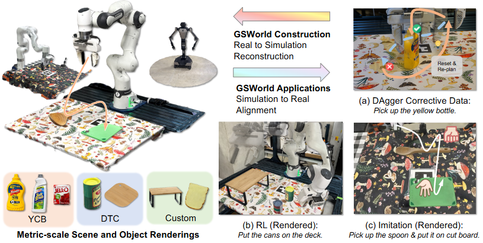

# GSWorld: Closed-Loop Photo-Realistic Simulation Suite for Robotic Manipulation

大部分内容来源于alphaxiv




## 核心贡献

**1. 完整的Real-to-Sim-to-Real流程管道**
- 提出了稳健的双向流程，能够准确地将真实环境与仿真环境对齐
- 使用ArUco标记进行度量尺度对齐，避免了手动标定
- 通过ICP算法对齐机器人URDF与场景，减少了自由度
- 这种对齐使得后续的多种应用成为可能

**2. GSDF资产格式（Gaussian Scene Description File）**
- 提出了新的资产格式，将Gaussian-on-Mesh表示与机器人URDF和物体融合
- 建立了包含3种机器人本体（单臂和双臂操作）和40多个物体的数据库
- 提供了可移植、可复用的标准化资产格式

**3. 照片级真实感仿真用于零样本Sim2Real迁移**

支持多种策略学习方式：
- **视觉模仿学习（IL）**：支持运动规划、遥操作等多种仿真数据收集方法，IL策略可直接部署到重建的真实场景
- **视觉强化学习（RL）**：设计了并行环境支持，分析表明GSWorld能够减少RL的sim2real视觉差距
- **闭环DAgger学习**：能够在仿真中重现真实世界的失败案例，自动收集纠正数据，显著提高数据效率

**4. 可复现的视觉基准测试**
- 提供标准化的GSDF资产、固定的相机内外参、一致的光照材质
- 实验表明仿真性能与真实世界性能高度相关
- 使得跨机器人、跨场景、跨任务的对比评估成为可能

**5. 虚拟遥操作数据收集**
- 支持通过键盘鼠标在照片级真实感仿真中收集遥操作数据
- 降低了真实机器人数据收集的成本

### 与现有工作的区别

论文强调GSWorld相比现有的基于Gaussian Splatting的模拟器（如SplatSim、Re3Sim等）的优势：
- 提供了有效的real-to-sim-to-real工作流
- 统一了照片级真实感3DGS与接触精确的物理引擎
- 支持可扩展的跨embodiment基准测试
- 实现零样本模仿学习和强化学习
- 自动化高质量DAgger数据收集以持续改进部署时的性能

这些贡献共同构成了一个"闭环"系统，能够在同一环境中训练、评估、诊断失败并重新标注数据，实现快速迭代。


***

## GSWorld工作流程详解

根据论文内容，GSWorld的工作流程可以分为**构建阶段**和**应用阶段**两大部分：

### 一、构建阶段：Real-to-Sim重建流程

#### 1. **数据采集（Collecting Training Views）**
- 使用机器人传感器（腕部相机和第三人称相机）
- 使用手机相机从多个视角拍摄
- 同时记录机器人的关节位置信息
- 拍摄数量：物体约100张，机器人场景约300张

#### 2. **度量尺度对齐（Aligning Scale for Metric Representation）**
- 在桌面上放置已知尺寸的**ArUco标记**
- 检测ArUco标记的关键点并投影到3DGS生成的点云上
- 利用已知的ArUco标记尺寸对点云进行缩放
- 优势：避免了COLMAP带来的尺度歧义，无需手动标定
- 额外好处：帮助识别碰撞中的支撑表面，估计重力方向

#### 3. **机器人和桌面对齐（Aligning Robots and Table）**
- 获得静态机器人的度量尺度3DGS重建 $\mathcal{G}_{real}$
- 从机器人URDF的视觉网格中采样并加密表面点云
- 执行**ICP算法**计算刚性变换 $T^{gs}_{R,sim}$：$\mathcal{G}_{real} = T^{gs}_{R,sim} \cdot \mathcal{S}_{sim}$
- 使用K-NN分割 $\mathcal{G}_{real}$ 中的机器人连杆
- 相比以前的方法，由于尺度固定，ICP自由度更少

#### 4. **物体资产处理（Object Assets）**
- **现有数据集**：集成DTC（照片级真实感质量）、YCB数据集
- **自定义物体**：使用2DGS进行重建和网格重建
- 通过称重估计质量
- 可选：使用amodal重建或3D生成方法修复未观察到的底部区域
- 同样使用ICP获得物体变换：$\mathcal{O}^{gs}_k = T^{gs}_{k,sim} \cdot \mathcal{O}_k$

#### 5. **生成GSDF资产**
- 将Gaussian Splatting重建与碰撞网格和材质属性结合
- 创建可移植的GSDF（Gaussian Scene Description File）格式
- 与现有物理引擎兼容

### 二、应用阶段：Sim-to-Real部署流程

GSWorld构建完成后，支持多种"闭环"应用：

#### **应用1：零样本Sim2Real模仿学习**

**数据收集：**
- 使用运动规划器（MPlib）在仿真中生成演示数据
- 或使用键盘鼠标进行虚拟遥操作
- 每个任务收集100条轨迹

**策略训练：**
- 输入：照片级真实感RGB图像 $I^{gs}_t = \mathcal{G}_{real}(p_t, s_t)$ + 机器人本体感知 $q_t$
- 输出：机器人动作 $a_t \sim \pi_\theta(I^{gs}_t, q_t)$
- 策略架构：ACT或Pi0

**直接部署：**
- 策略在仿真中用3DGS渲染训练，直接部署到真实机器人
- 由于视觉和动作空间对齐，实现零样本迁移

---

#### **应用2：闭环DAgger持续改进**

这是GSWorld最独特的"闭环"能力：

**迭代流程：**

```
第1轮：初始策略训练
  ├─ 收集100条专家演示
  ├─ 训练策略 π₀
  └─ 部署评估
      ↓
第2-5轮：DAgger迭代
  ├─ 在仿真中rollout当前策略
  ├─ 记录所有失败轨迹 D_f = (s₁,...,s_T)
  ├─ 从失败状态中随机采样恢复状态 s_r ~ D_f
  │   （选择任务仍可完成的前序状态）
  ├─ 使用运动规划器从 s_r 生成纠正数据
  ├─ 聚合数据集：τ_S = Σᵢ(Q_s, O_s, A_s)ᵢ
  ├─ 重新训练策略
  └─ 再次部署评估
```

**两种DAgger模式：**

1. **Sim2Real DAgger**：
   - 策略完全用仿真数据训练
   - 数据集：$\tau_S = \Sigma_i(Q_s, \mathcal{O}_s, A_s)_i$
   - 5轮迭代后性能提升显著（如Place Box: 40%→76% sim, 40%→70% real）

2. **Real2Sim2Real DAgger**：
   - 先用少量真实演示训练初始策略
   - 然后在GSWorld中进行DAgger改进
   - 数据集：$\tau_R = (Q_r, O_r, A_r) \cup \tau_S$
   - 避免昂贵的真实世界数据收集

---

#### **应用3：视觉基准测试**

**标准化评估流程：**
1. 在真实世界训练多个策略（不同架构、不同数据量）
2. 在GSWorld中评估相同策略
3. 对比仿真与真实性能的相关性

**实验结果：**
- 仿真与真实成功率高度相关（见Fig. 9）
- 例如ACT平均：sim 41% vs real 50%
- 例如Pi0平均：sim 43.5% vs real 55%
- 证明GSWorld可作为可靠的性能预测工具

---

#### **应用4：虚拟遥操作**

- 使用键盘鼠标在照片级真实感环境中遥操作
- 定义关键帧，使用运动规划器达到目标姿态
- 渲染照片级真实感视频用于数据集
- 展示了双臂机器人Galaxea R1的遥操作

---

#### **应用5：视觉强化学习**

**训练流程：**
- 使用**并行环境**加速RL训练
- 优化：只并行化与运动部件（机器人、物体）相关的3DGS点，静态背景共享
- 使用非对称SAC：
  - Critic：访问仿真特权信息
  - Actor：只使用机器人关节位置 + 照片级真实感RGB

**实验结果：**
- Grasp Banana：真实成功率30%（基线ManiSkill 0%）
- Tidy Table：真实成功率20%（基线ManiSkill 5%）
- 证明GSWorld减少了RL的sim2real视觉差距

---

### 三、关键技术特点

#### **"闭环"的含义**
同一环境可以：
1. **训练**：用照片级真实感渲染训练策略
2. **评估**：在仿真中rollout策略
3. **诊断**：逐帧检查失败案例
4. **重新标注**：从失败状态收集纠正数据
5. **再训练**：用聚合数据集迭代改进

#### **对齐保证**
- **视觉对齐**：3DGS提供照片级真实感渲染
- **几何对齐**：ArUco标记确保度量精度
- **动作空间对齐**：仿真与真实使用相同的机器人API
- **物理对齐**：碰撞网格和材质属性

#### **实现细节**
- 与Gym接口高度兼容（仅需一行代码启用）
- 支持多种物理后端（论文使用ManiSkill）
- 训练：50,000次迭代，SGD优化器，学习率0.0001
- 仿真评估：25个随机种子，500-800时间步
- 真实评估：10次试验，随机初始条件

这个工作流程的最大创新在于将高质量的视觉渲染与精确的物理仿真相结合，同时提供了从真实世界到仿真再回到真实世界的完整闭环，使得机器人策略的开发、测试和改进可以高效迭代。

***

## GSWorld中仿真器的使用

是的，GSWorld **严重依赖物理仿真器**，它并不是一个独立的仿真器，而是在现有仿真器之上提供照片级真实感渲染的**接口层（Interface/Wrapper）**。

### 一、使用的仿真器

#### **主要仿真器：ManiSkill3**

论文明确提到：

> "We define a range of manipulation tasks using **ManiSkill [51]** as the simulator backend." (Section IV-C)

**ManiSkill3的特点：**
- GPU并行化的机器人仿真环境
- 支持大规模并行环境（对RL训练至关重要）
- 提供标准的Gym接口
- 处理物理碰撞、动力学模拟

#### **其他提到的物理引擎：**

在相关工作部分提到了多个物理引擎和仿真器：

1. **PyBullet** - SplatSim使用的后端
2. **MuJoCo** - 高效的物理引擎
3. **Isaac Sim/Gym** - NVIDIA的仿真平台
4. **Sapien** - 基于物理的交互环境

论文在实验中主要使用**ManiSkill**，因为它支持GPU并行化。

---

### 二、GSWorld与仿真器的关系架构

从Figure 2可以看出清晰的架构：

```
┌─────────────────────────────────────────────────┐
│                   GSWorld                        │
│  ┌──────────────────────────────────────────┐  │
│  │        GSDF (Asset Format)               │  │
│  │  - Robot URDFs                           │  │
│  │  - 3DGS Reconstructions                  │  │
│  │  - Collision Meshes                      │  │
│  │  - Material Properties                   │  │
│  └──────────────────────────────────────────┘  │
│                      │                           │
│         ┌────────────┴────────────┐             │
│         ▼                         ▼             │
│  ┌─────────────┐        ┌──────────────────┐   │
│  │Photo-Real   │        │Physics Simulation│   │
│  │Rendering    │        │Backend           │   │
│  │(3DGS)       │        │(ManiSkill/etc.)  │   │
│  └─────────────┘        └──────────────────┘   │
│         │                         │             │
│         └────────────┬────────────┘             │
│                      ▼                           │
│              ┌──────────────┐                   │
│              │ Applications │                   │
│              │- IL / RL     │                   │
│              │- DAgger      │                   │
│              │- Benchmark   │                   │
│              └──────────────┘                   │
└─────────────────────────────────────────────────┘
```

**关键点：**
- **物理仿真器**负责：碰撞检测、动力学计算、状态更新
- **3DGS渲染**负责：照片级真实感RGB图像生成
- **GSWorld**作为胶水层，统一两者

---

### 三、具体使用方式

#### **1. 作为Gym Wrapper使用**

论文附录E提供了代码示例：

```python
# 首先创建标准的ManiSkill环境
env = gym.make(
    env_id,
    robot_uids=args.robot_uid,
    obs_mode=args.obs_mode,
    control_mode=args.control_mode,
    render_mode=args.render_mode,
    reward_mode="dense",
    max_episode_steps=args.ep_len,
)

# 用GSWorld包装，替换渲染
env = GSWorldWrapper(
    env=env,
    gs_cfg=args.gs_cfg,  # 3DGS配置
    device="cuda",
)

# 之后就像普通Gym环境一样使用
obs, _ = env.reset()
obs, reward, terminated, truncated, info = env.step(action)
```

**工作原理：**
1. ManiSkill处理物理模拟，更新状态 $s_t = (q_t, x^1_t, ..., x^n_t)$
2. GSWorldWrapper拦截观测渲染
3. 用3DGS渲染照片级真实感图像：$I^{gs}_t = \mathcal{G}_{real}(p_t, s_t)$
4. 返回给策略的观测包含3DGS渲染的RGB图像

---

#### **2. 物理仿真器的职责**

根据论文描述，物理后端负责：

**a) 碰撞检测：**
- GSDF中包含collision meshes（碰撞网格）
- 物理引擎使用这些网格计算碰撞

> "Our GSDF assets are compatible with existing simulators to use standard formats for... computing physics collisions." (Fig. 2 caption)

**b) 动力学模拟：**
- 机器人关节运动学/动力学
- 物体刚体动力学
- 接触力计算
- 摩擦、惯性等物理参数

**c) 状态管理：**
- 机器人关节位置 $q_t \in \mathbb{R}^m$
- 物体6D位姿 $x^k_t$
- 环境状态 $s_t$

**d) 其他功能：**
- 深度图渲染（非照片级）
- 分割图渲染
- 奖励计算（RL任务）
- Episode管理

---

#### **3. 3DGS与物理同步机制**

这是GSWorld的核心技术挑战：

**状态同步流程：**

```python
# 伪代码说明同步机制
def step(action):
    # 1. 物理引擎更新状态
    new_state = physics_engine.step(action)
    # new_state包含：
    #   - 机器人关节位置 q_t
    #   - 物体位姿 {x_1, x_2, ..., x_n}
    
    # 2. 更新3DGS Gaussians位置
    for obj_id, pose in new_state.object_poses:
        # 获取物体的3DGS点
        gs_points = gsdf_assets[obj_id].gaussians
        
        # 应用变换（旋转+平移）
        transformed_gs = apply_transform(gs_points, pose)
        
        # 更新渲染器中的Gaussian位置
        renderer.update_gaussians(obj_id, transformed_gs)
    
    # 对机器人各关节链接做同样操作
    for link_id, joint_state in new_state.robot_joints:
        link_gs = gsdf_assets['robot'][link_id].gaussians
        link_pose = forward_kinematics(joint_state)
        transformed_gs = apply_transform(link_gs, link_pose)
        renderer.update_gaussians(link_id, transformed_gs)
    
    # 3. 用3DGS渲染观测
    rgb_image = renderer.render(camera_pose)
    
    # 4. 返回观测
    return {
        'rgb': rgb_image,  # 3DGS渲染
        'depth': physics_engine.render_depth(),  # 物理引擎
        'state': new_state
    }
```

**关键技术：**
- **Gaussian-on-Mesh表示**：Gaussians附着在物体网格上
- **刚性变换**：物体移动时，其所有Gaussians一起变换
- **分离渲染**：静态背景Gaussians只渲染一次，动态部分每帧更新

---

#### **4. RL中的并行环境优化**

论文特别强调了针对RL的优化：

> "GSWorld optimizes its implementation by only parallelizing 3DGS points that are linked with moving parts of the scene, i.e., robot R and objects O, and keeps other points cached with just one copy." (Section III-C)

**并行策略：**

```
单GPU运行N个并行环境：

环境1: [静态背景GS (共享)] + [机器人GS (独立)] + [物体GS (独立)]
环境2: [静态背景GS (共享)] + [机器人GS (独立)] + [物体GS (独立)]
...
环境N: [静态背景GS (共享)] + [机器人GS (独立)] + [物体GS (独立)]

优势：
- 节省GPU内存
- 加速RL训练（论文用于SAC训练）
- 每个环境的物理状态由ManiSkill独立管理
```

---

### 四、物理参数来源

#### **从GSDF资产获取：**

1. **碰撞网格**：
   - 从URDF（机器人）或扫描（物体）获取
   - 简化网格用于高效碰撞检测

2. **物理属性**：
   - 质量：称重测量（物体），URDF参数（机器人）
   - 惯性张量：从网格计算或URDF
   - 摩擦系数、弹性系数：实验测量或默认值

3. **关节参数**（机器人）：
   - 完全从URDF读取
   - 关节限制、扭矩限制、阻尼等

---

### 五、与其他系统的对比

#### **SplatSim（前作）的限制：**
- 使用PyBullet作为后端
- 需要手动3D分割机器人和物体
- 针对单个场景过拟合

#### **GSWorld的改进：**
- 支持多种物理后端（主要用ManiSkill）
- 自动化分割流程（通过ICP + K-NN）
- 可扩展的GSDF资产格式
- 更好的并行化支持（对RL重要）

---

### 六、实验中的使用统计

#### **仿真评估设置：**
- **评估次数**：每个任务25个随机种子
- **时间步限制**：
  - Place Box, Pour Sauce, Stack Cans: 500步
  - Arrange Cans: 800步（更长任务）
- **控制模式**：关节位置控制
- **观测**：双目RGB图像 + 机器人本体感知

#### **RL训练设置：**
- 使用ManiSkill的并行环境能力
- 非对称SAC算法
- Critic看到仿真特权信息（物体位姿等）
- Actor只看到RGB + 关节位置

---

### 总结

**GSWorld的定位：**
```
GSWorld = 物理仿真器（ManiSkill等） + 照片级真实感渲染（3DGS）
```

**分工明确：**
- **物理仿真器**：提供"正确的物理"（碰撞、动力学、接触）
- **3DGS渲染**：提供"正确的视觉"（照片级真实感）
- **GSWorld框架**：桥接两者，提供统一接口

**使用便捷性：**
- 仅需一行代码包装现有环境
- 完全兼容Gym接口
- 支持现有的IL/RL训练流程

这种设计使得GSWorld可以**即插即用**地为现有仿真器添加照片级真实感渲染能力，而不需要重新实现物理引擎。