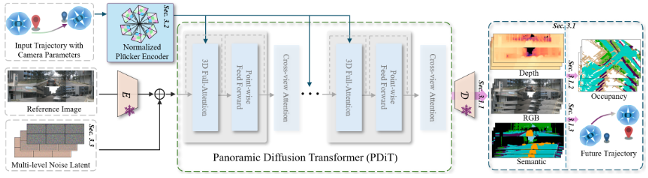

# OmniNWM: Omniscient Driving Navigation World Models

大部分内容来源于alphaxiv


根据这篇论文，OmniNWM的主要贡献可以总结为以下几点：

## 核心贡献

**1. 统一的state-action-reward框架**
OmniNWM提出了首个将状态（state）、动作（action）和奖励（reward）三个核心维度统一在单一框架内的全景导航世界模型，实现了：
- **State（状态）**：联合生成全景RGB、语义、度量深度和3D占据视频
- **Action（动作）**：通过归一化Plücker光线图实现精确的全景相机控制
- **Reward（奖励）**：基于生成的3D占据直接定义基于规则的密集奖励

**2. 归一化全景Plücker光线图表示**
提出了一种新的动作控制方法：
- 将轨迹编码为归一化的全景Plücker光线图，提供像素级的统一表示
- 实现了尺度不变和姿态不变的归一化，显著提升了轨迹分布的多样性
- 支持精确的全景视频生成控制和跨数据集、跨相机配置的零样本泛化

**3. 灵活强制策略（Flexible Forcing Strategy）**
创新的训练策略：
- 在训练时沿视图和帧维度注入独立的多层级噪声
- 支持超越训练长度的长期自回归生成（321帧 vs 241帧ground truth）
- 支持帧级和片段级的自回归推理模式

**4. 占据驱动的密集奖励机制**
不依赖外部模型的奖励计算：
- 利用生成的3D语义占据直接定义驾驶合规性和安全性的密集奖励
- 包括碰撞奖励（Rcol）、边界奖励（Rbd）和速度奖励（Rvel）
- 实现了可靠的闭环评估框架

**5. 多模态联合生成**
- 同时生成像素对齐的RGB、语义、深度和3D占据
- 通过共享解码器确保跨模态的强一致性
- 相比基于体素的方法更轻量，同时保持高质量

### 性能优势

- **视频生成质量**：FID 5.45，FVD 23.63，达到SOTA水平
- **深度估计**：Abs. Rel. 0.23，超越判别式和生成式方法
- **占据预测**：IoU 33.3，mIoU 19.8，显著优于现有方法
- **相机控制精度**：RotErr降至1.42×10⁻²，接近ground truth性能
- **零样本泛化能力**：可跨数据集和相机配置进行生成

这项工作为自动驾驶世界模型建立了新的范式，实现了全面、精确和可评估的驾驶场景生成。


***

## OmniNWM架构详解

根据论文，OmniNWM的架构可以分为以下几个核心模块：

### 1. 整体架构概览

OmniNWM采用**端到端的统一框架**，主要包含：
- **Panoramic Diffusion Transformer (PDiT)** - 全景扩散Transformer
- **Normalized Plücker Encoder** - 归一化Plücker编码器
- **3D VAE** - 3D视频自编码器
- **Occupancy Generation Module** - 占据生成模块
- **OmniNWM-VLA** - 轨迹规划agent

---

### 2. 核心模块详解

#### 2.1 全景扩散Transformer (PDiT)

**参数规模**：11.22B参数
- 11B的Diffusion Transformer主干网络
- 0.22B的新增跨视图注意力层参数

**功能**：
- 对压缩后的时空latent进行去噪
- 采用**跨视图注意力机制**处理多相机全景输入
- 使用**flow matching**训练目标，预测速度分量 X₀ - X₁

**输入**：
- 历史轨迹编码的归一化Plücker光线图
- 参考图像
- 多层级噪声latent

**输出**：
- 去噪后的latent，解码为RGB、语义、深度视频

---

#### 2.2 归一化Plücker编码器

这是OmniNWM的**关键创新**之一，实现精确的相机控制。

**编码过程**：

**Step 1: Plücker坐标构建**
```
对于像素(u,v)，Plücker嵌入定义为：
p_{u,v} = (o × d_{u,v}, d_{u,v}) ∈ ℝ⁶

其中：
- o = t (相机中心)
- d_{u,v} = RK⁻¹[u,v,1]ᵀ + t (方向向量)
```

**Step 2: 尺度和姿态归一化**

针对全景第k个相机：
```
尺度归一化：
d̂_{u,v}^{(k)} = R_k K₀⁻¹[u,v,1]ᵀ  (使用参考相机内参K₀)

姿态归一化：
o_{k→0} = R₀R_k^T(t_k - t₀)  (变换到参考坐标系)
d̂_{u,v}^{(k→0)} = R₀R_k^T d̂_{u,v}^{(k)}

最终归一化Plücker坐标：
p̂_{u,v}^{(k)} = (o_{k→0} × d̂_{u,v}^{(k→0)}, d̂_{u,v}^{(k→0)})
```

**优势**：
- 提供**像素级**的统一控制信号
- 实现**尺度不变**和**姿态不变**
- 轻量级，无需额外参数

**注入方式**：
- 光线图经过下采样与diffusion latent对齐
- Patchify成Plücker embedding tokens
- 与latent tokens拼接后输入PDiT的3D全注意力层

---

#### 2.3 多模态生成模块

**编码阶段**：
```
使用预训练3D VAE将视频编码为latent
压缩比：4×8×8 (时间×空间×空间)
```

**联合去噪**：
- 为RGB、语义、深度初始化**独立的噪声latent**
- 沿通道维度拼接后输入PDiT联合去噪
- 共享解码器产生像素对齐的多模态输出

**语义处理细节**：
- 训练前：语义图着色后再VAE编码
- 训练后：解码后通过最近邻匹配转回离散标签

---

#### 2.4 3D占据生成模块

基于生成的RGB、深度、语义进行**轻量级占据预测**。

**特征提取**：
```
F_i ← EfficientNet-B7(RGB)  (预训练)
F_d ← DepthEncoder(Depth)
F_s ← SemanticEncoder(Semantic)
```

**自适应融合**：
```
通过SE3D blocks进行自适应聚合：
V̂ = Adap_d(F_i, F_d) ⊗ Adap_s(F_i, F_s)

其中⊗为外积操作
```

**输出**：
- 3D语义体素体积
- 用于计算occupancy-grounded rewards

**优势**：
- 相比直接生成体素的方法**更轻量**
- 自然支持密集奖励的集成

---

#### 2.5 灵活强制策略

**多层级噪声注入**：

训练时对每帧i和每视图j独立加噪：
```
x̃^{(i,j)} = x^{(i,j)} + α^{(i)}·ϵ_frame + β^{(j)}·ϵ_view

其中：
- ϵ_frame ~ N(0,I) (帧级噪声)
- ϵ_view ~ N(0,I) (视图级噪声)
- α^{(i)}, β^{(j)} 为缩放因子
```

**推理模式**：

**模式1：帧级自回归**
```
x̂^{(t+1)} = f_θ(x̃^{(t-K)}, ..., x̃^{(t)})
适用：逐帧轨迹规划模拟
```

**模式2：片段级自回归**
```
x̂^{(t+1)}, ..., x̂^{(t+L)} = f_θ(x̃^{(t-M)}, ..., x̃^{(t)})
适用：长期高效生成
```

---

### 3. OmniNWM-VLA规划Agent

基于**Qwen-2.5-VL**构建的语义-几何推理agent。

#### 3.1 Tri-Modal Mamba-based Interpreter (Tri-MIDI)

**输入处理**：
```
1. 全景拼接：X_V, X_D, X_S → P_V, P_D, P_S
2. 模态编码：
   H_V = CLIP(P_V)
   H_D = SigLIP(P_D)
   H_S = SegFormer(P_S)
3. 投影：Z_α = φ_α(H_α), α ∈ {V,D,S}
```

**跨模态融合**：
```
H_R = f_LM([Z_V; Z_D; Z_S], X_T)

其中：
- f_LM 是Mamba状态空间模型
- X_T 是文本查询
```

**TOR机制**：
```
在查询序列中插入特殊tokens锚定中间推理步骤
Z_TOR = φ_R(H_R^{tor})
```

#### 3.2 输出

- **路径点坐标** (x, y)
- **航向角** (heading angles)
- 以**12Hz频率**生成（vs 先前工作的2Hz）

---

### 4. 训练目标

#### PDiT视频生成损失：
```
L_PDiT = E_{t,X₀,X₁}[||f_θ(X_t, t, y) - (X₀ - X₁)||]

其中X_t = (1-t)X₀ + tX₁
```

#### 占据预测损失：
```
L_Occ = L_depth + λ_sem L_sem + λ_geo L_geo + λ_ce L_ce
```

#### VLA规划损失：
```
L_VLA = -E_{(x,y)~D} Σ_{t=1}^T log P(y_t|y_{<t}, x)
```

---

### 5. 架构优势

✅ **统一框架**：state-action-reward三位一体  
✅ **精确控制**：像素级Plücker光线图  
✅ **长期稳定**：灵活强制策略支持321帧生成  
✅ **轻量高效**：占据预测无需直接生成体素  
✅ **多模态对齐**：联合生成确保一致性  
✅ **闭环能力**：集成规划agent和奖励机制  

这种设计使OmniNWM成为一个**全能的自动驾驶世界模型**，实现了从感知到决策的完整闭环。


***

## OmniNWM训练数据标注需求分析

根据论文内容，OmniNWM的训练数据有**部分需要标注，部分通过自动化方法生成**。具体如下：

---

### 1. 各模态数据来源

#### ✅ 需要标注/已有标注的数据

**RGB视频**
- **来源**：NuScenes数据集自带的6个相机视角的RGB图像
- **标注**：无需额外标注（原始传感器数据）
- **频率**：12Hz

**3D占据ground truth**
- **来源**：NuScenes-Occupancy数据集
- **标注**：需要人工/半自动标注的3D语义体素
- **用途**：训练占据生成模块的监督信号

**轨迹数据**
- **来源**：NuScenes自带的ego vehicle轨迹
- **标注**：无需额外标注（车辆定位数据）
- **包含**：位置坐标、航向角、速度等

---

#### 🔧 自动生成/伪标注的数据

**语义分割标签**

论文明确说明语义标签是**自动生成**的：

```
"To construct semantic labels for the NuScenes dataset, 
we finetune a pretrained DDRNet model on diverse driving 
scenes to enhance robustness."
```

**生成流程**：
1. 在多个数据集上微调DDRNet：
   - Cityscapes
   - Mapillary Vistas  
   - Waymo Open
   - Woodscape
   - BDD100k

2. 使用图像翻译技术合成夜间场景数据增强泛化性

3. 在NuScenes上以**12Hz**推理生成语义标签

**关键**：这是**伪标签**（pseudo labels），不需要人工标注

---

**度量深度图**

同样是**自动生成**的：

```
"For metric depth supervision, we follow established practices: 
sparse LiDAR-projected depth and MVS-reconstructed depth maps, 
along with corresponding RGB images, are fed into a depth 
completion model to generate dense, accurate depth maps."
```

**生成流程**：
1. 从LiDAR投影得到**稀疏深度**
2. 使用MVS（多视图立体）重建深度
3. 输入深度补全模型（DepthLab等）生成**密集深度图**

**关键**：利用LiDAR作为监督，无需人工标注

---

### 2. VLA规划模块的数据需求

**OmniNWM-VLA的训练数据**：

论文提到：
```
"The model is trained on a curated dataset of driving 
scenarios with multi-modal annotations."
```

这里需要：
- ✅ **轨迹标注**（NuScenes已有）
- ✅ **驾驶场景描述**（可能需要语言标注）
- ✅ **多模态输入**（RGB、深度、语义 - 前面已自动生成）

**可能的标注需求**：
- 驾驶意图的自然语言描述
- 但论文未明确说明是否需要额外标注

---

### 3. 标注工作量总结

| 数据类型 | 是否需要标注 | 获取方式 |
|---------|------------|---------|
| **RGB视频** | ❌ 不需要 | 数据集原始数据 |
| **相机参数** | ❌ 不需要 | 数据集标定数据 |
| **轨迹数据** | ❌ 不需要 | 车辆定位系统 |
| **语义分割** | ❌ 不需要 | DDRNet自动推理 |
| **深度图** | ❌ 不需要 | LiDAR+深度补全 |
| **3D占据** | ✅ 需要 | NuScenes-Occupancy提供 |
| **VLA语言指令** | ⚠️ 可能需要 | 论文未详述 |

---

### 4. 关键优势：最小化标注依赖

OmniNWM的设计**显著降低了标注需求**：

#### 🎯 策略1：利用已有数据集标注
- 直接使用NuScenes和NuScenes-Occupancy的标注
- 避免重复标注工作

#### 🎯 策略2：自动生成伪标签
- **语义**：强大的分割模型推理
- **深度**：LiDAR监督的深度补全
- 质量接近人工标注（论文Table 3显示超越部分判别式方法）

#### 🎯 策略3：联合训练降低监督需求
```
"Joint generation of pixel-aligned multi-modal outputs 
has shown great potential to enhance the representational 
capacity of generative models."
```
- RGB的生成质量可以隐式提升其他模态
- 跨模态一致性约束提供额外监督信号

---

### 5. 实际部署建议

如果你想复现OmniNWM：

#### 必需的标注数据：
✅ NuScenes数据集（公开，含轨迹）  
✅ NuScenes-Occupancy标注（公开）

#### 需要自己生成的：
🔧 在NuScenes上运行DDRNet生成语义  
🔧 使用深度补全模型生成深度图

#### 可选的额外工作：
⚠️ 如需训练VLA可能要准备语言标注  
⚠️ 但可以尝试利用现有VLM的零样本能力

---

### 6. 论文的创新之处

在标注方面，OmniNWM的**智慧设计**体现在：

1. **不依赖完美标注**：
   - 伪标签足以训练高质量生成模型
   - 生成式建模对噪声标注更鲁棒

2. **自监督和弱监督**：
   - 深度通过LiDAR稀疏监督
   - 语义通过预训练模型迁移
   - 占据通过多模态融合

3. **数据效率**：
   - 论文Table 3显示，仅用相机输入就超越LiDAR方法
   - 证明了生成式范式的数据效率

---

### 总结

**核心答案**：OmniNWM**最小化了人工标注需求**

- ✅ 主要依赖NuScenes和NuScenes-Occupancy的**已有标注**
- ✅ 语义和深度通过**自动化流程生成**，无需人工标注
- ⚠️ 唯一明确需要的标注是**3D占据**（但已公开提供）
- ⚠️ VLA部分可能需要语言标注（论文未详述，可能用现有VLM数据）

这使得OmniNWM在实际应用中**非常实用**，不需要大规模昂贵的数据标注工作。